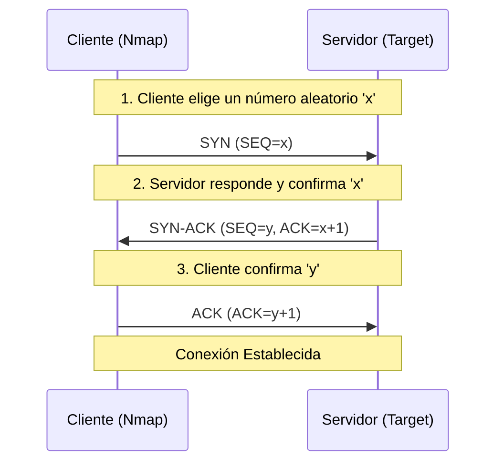
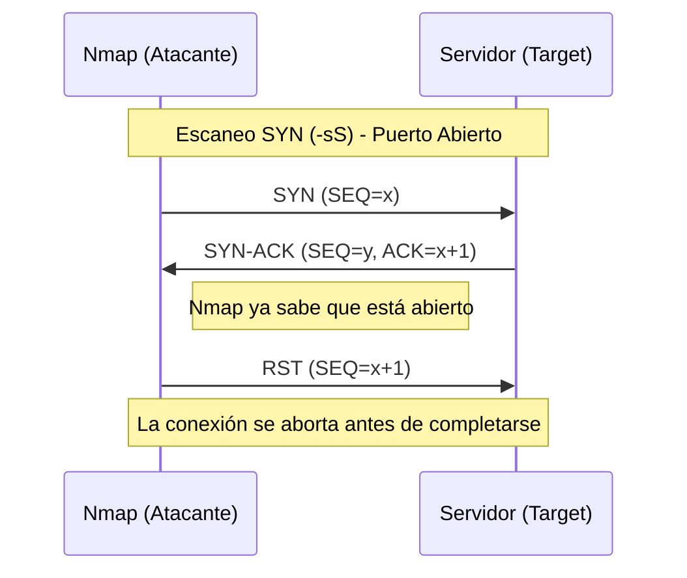
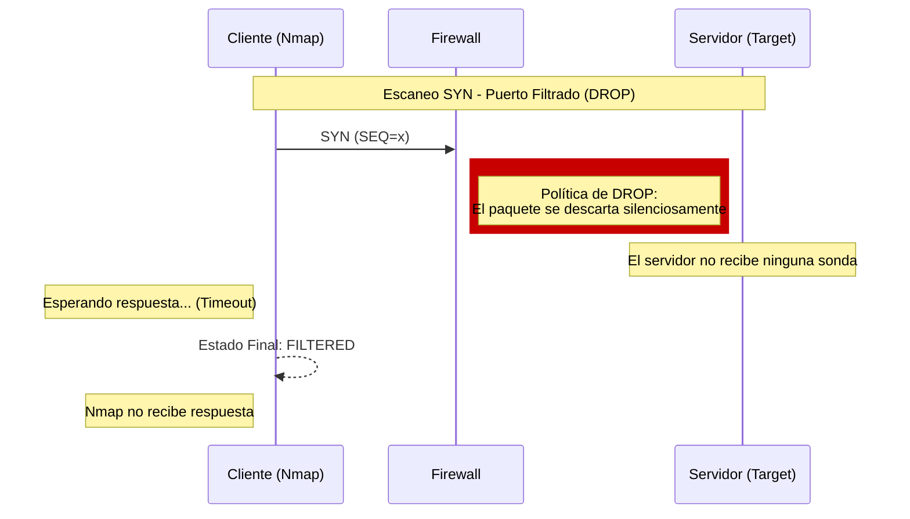

<div style="position: fixed; right: 20px; top: 100px; width: 200px; background: #f8f9fa; padding: 15px; border: 1px solid #ddd; border-radius: 8px; font-size: 14px; z-index: 1000;" class="sidebar-manual">
  <strong>📍 Navegación</strong>
  <ul style="list-style: none; padding: 0; margin-top: 10px;">
    <li><a href="#introducción">1. Introducción</a></li>
    <li><a href="#enumeracion-de-host">2. Enumeración de Host</a></li>
    <li><a href="#bypass-de-medidas-de-seguridad">3. Bypass de medidas de seguridad</a></li>
  </ul>
</div>

# Introducción
## Enumeración

>***Enumerar*** implica definir exhaustivamente la ***superficie de ataque***.
>
>Consiste en interrogar a los servicios activos para obtener un inventario detallado de su comportamiento; cuanto más denso sea este inventario, más visibles se vuelven las vulnerabilidades potenciales y los vectores de entrada que de otro modo pasarían desapercibidos.

La mayoría de las formas en que podemos acceder a los sistemas destinos las podemos limitar a dos puntos:
- ***Funciones y/o recursos que nos permiten interactuar con el objetivo y/o nos proveen de información adicional.***
- ***Información que nos da información aún más importante para acceder a nuestro objetivo***

>***IMPORTANTE***
>La mayor parte de la información que obtenemos proviene de configuraciones incorrectas o negligencia en la seguridad de los servicios que están accesibles al público.

## Introducción a Nmap

>***Network Mapper*** (***Nmap***) nació como una solución de código abierto para el mapeo de infraestructuras, permitiendo a los auditores descubrir qué sistemas están operando realmente en un segmento de red mediante el envío de paquetes crudos.

***Nmap*** es mucho más que un simple escáner de red, es una herramienta fundamental de reconocimiento que permite mapear la superficie de ataque de un objetivo. Su función principal es ***detectar puertos abiertos*** y servicios en ejecución, pero su verdadero potencial reside en su capacidad para analizar la respuesta de los paquetes. Mediante técnicas de escaneo avanzadas, Nmap puede deducir la presencia de ***firewalls*** (identificando estados "*filtrados*") y detectar ***Sistemas de Detección de Intrusos (IDS)***, permitiendo al auditor de seguridad comprender no solo qué puertas están abiertas, sino también qué defensas están vigilando la entrada. 
## Sintaxis
<div align=center><code>
nmap [tipo_escaneo] [opciones] [objetivo]
</code></div>

## Técnicas de escaneo

>***Nmap*** implementa diversas metodologías de reconocimiento basadas en la manipulación de los mecanismos de conexión y el envío de paquetes con estructuras personalizadas, permitiendo analizar el comportamiento del objetivo a nivel de protocolo.

```bash
nmap --help

<snip>
SCAN TECHNIQUES:
	-sS/sT/sA/sW/sM: TCP SYN/Connect()/ACK/Window/Maimon scans
	-sU: UDP Scan
	-sN/sF/sX: TCP Null, FON, and Xmas scans
	--scanflags <flags>: Customize TCP scan flags
	-sI <zombie host[:probeport]>: Idle scan
	-sY/sZ: SCTP INIT/COOKIE-ECHO scans
	-sO: IP protocol scan
	-b <FTP relay host>: FTP bounce scan
<snip>
```

---
# Enumeración de host
## Host discovery

Antes de lanzar ataques específicos, un auditor necesita "*ver*" el terreno. El descubrimiento de hosts nos permite filtrar el ruido y centrarnos únicamente en las máquinas que responden, ahorrando tiempo y evitando ruido innecesario. Para descubrir dichos sistemas, podemos usar varias opciones de descubrimiento de host de ***Nmap***.

Hay muchas opciones que ***Nmap*** nos proporciona para saber si nuestro objetivo está vivo o no. El método de descubrimiento de host más eficaz es usar las ***ICMP Echo Requests***.
### ICMP Echo Requests

Las ***Solicitudes Echo de ICMP*** (o en inglés "*ICMP Echo Requests*") son un tipo específico de mensaje perteneciente al protocolo ***ICMP*** (*Internet Control Message Protocol*), identificados técnicamente como ***ICMP Tipo 8***.

Su función es el pilar de la herramienta `ping`: *Un host emisor envía un paquete **Echo Request** a una dirección IP de destino con la expectativa de que, si el host está activo y no hay resctricciones de seguridad o de red, este responda con un paquete **ICMP Echo Reply** (Tipo 0)*.

> ***IMPORTANTE***
>***ICMP Tipo 8 (Echo Request):*** La "*sonda*" enviada para verificar la actividad de un host.
>***ICMP Tipo 0 (Echo Reply):*** La respuesta que confirma que el host está activo.
### Escanear rango de red

```bash
sudo nmap 192.168.2.0/24 -sn -oA tnet | grep for | cut -d" " -f5

192.168.2.4
192.168.2.10
192.168.2.11
192.168.2.18
192.168.2.19
192.168.2.20
192.168.2.28
```


- `192.168.2.0/24`: Indica el alcance del escaneo. El `.0` especifica que queremos escanear toda la red, mientras que el `/24` indica que hay un total de ***254*** posibles hosts (del *1* al *254*, ya que el *0* se utiliza para representar la totalidad de la red y el *255* para la dirección ***broadcast***).
- `-sn`: Desactiva el escaneo de puertos.
- `-oA tnet`: Almacena los resultados en todos los formatos comenzando con el nombre "***tnet***".

> ***NOTA***
>Es decir, el comando escanea toda la red `192.168.2.0/24` sin tratar de encontrar puertos abiertos (tan solo verificando los hosts activos de la red) y almacena dicho escaneo en todos los formatos posibles  para una revisión posterior manual o automatizada.
### Escanear lista de IP

Ahora imaginemos que tenemos un archivo con una lista de IPs que queremos escanear:
```bash
cat hosts.lst

192.168.2.4
192.168.2.10
192.168.2.11
192.168.2.18
192.168.2.19
192.168.2.20
192.168.2.28
```

Podemos especificarle a Nmap un archivo que contenga una lista de posibles IPs activas en la red.

```bash
sudo nmap -iL hosts.lst -sn -oA tnet | grep for | cut -d" " -f5

192.168.2.18
192.168.2.19
192.168.2.20
```

- `-iL`: Realiza escaneos definidos contra los objetivos en la lista "`hosts.lst`".
- `-sn`: Desactiva el escaneo de puertos.
- `-oA`: Almacena los resultados en todos los formatos comenzando con el nombre "***tnet***".

>***NOTA***
>En este ejemplo, solo *3* de los *7* hosts están activos.
>
>***¡Ojo!*** Un host que no responde a ICMP no siempre está apagado. En auditorías reales, es común encontrar firewalls que descartan estas sondas para que no podamos realizar conexiones y así asegurar la red.
### Escanear varias IPs

Si queremos escanear varias IPs concretas podemos especificarlas una a una:

```bash
sudo nmap 192.168.2.18 192.168.2.19 192.168.2.20 -sn -oA tenet | grep for | cut -d" " -f5

192.168.2.18
192.168.2.19
192.168.2.20
```

O, si estas IPs son sucesivas unas de otras, podemos definir un rango:

```bash
sudo nmap 192.168.2.18-20 -sn -oA tenet | grep for | cut -d" " -f5

192.168.2.18
192.168.2.19
192.168.2.20
```
### Escanear una sola IP

```bash
sudo nmap 192.168.2.18 -sn -oA host

Starting Nmap 7.80 ( https://nmap.org) at 2020-06-14 23:59 CEST
Nmap scan report for 192.168.2.18
Host is up (0.087s latency).
MAC Address: AA:BB:CC:DD:EE:FF
Nmap done: 1 IP address (1 host up) scanned in 0.11 seconds
```

> ***TIP***
>La opción `-sn` especifica que no queremos realizar un escaneo de puertos en este momento. Por lo que si lo usamos, Nmap realizará automáticamente un escaneo de ping utilizando el protocolo ***ICMP*** para enviar ***Echo Requests (`-PE`)***.  
### ARP Ping

Sin embargo, los escaneos que hemos estado haciendo hasta ahora no realizaron ***pings*** incluso cuando desactivábamos el escaneo de puertos, ya que Nmap envía un ***ARP Ping*** dando como resultado un ***ARP Reply***.
#### ARP vs ICMP

Un detalle que suele confundir a los analistas que están empezando es que, al escanear objetivos en una ***red local (Capa 2)***, Nmap ignora por defecto nuestras peticiones de ***ICMP (ping)*** y utiliza ***ARP***. Esto es debido a que ARP es mucho más fiable, ya que un firewall puede bloquear un ping, pero si una máquina quiere comunicarse en una LAN, *debe responder a las solicitudes ARP para mapear su IP con su dirección MAC*.

Podemos visualizar este comportamiento invisible para el usuario usando la opción `--packet-trace`, que nos permite auditar cada paquete que sale y entra de nuestra interfaz.

```bash
sudo nmap 192.168.2.18 -sn -oA host -PE --packet-trace

Starting Nmap 7.80 ( https://nmap.org) at 2020-06-15 00:08 CEST
SENT (0.0074s) ARP who-has 192.168.2.18 tell 192.168.2.110
RCVD (0.0309s) ARP reply 192.168.2.18 is-at DE:AD:00:00 BE:EF
Nmap scan report for 192.168.2.18
Host is up (0.023s latency).
MAC Address: AA:BB:CC:DD:EE:FF
Nmap done: 1 IP address (1 host up) scanned in 0.05 seconds
```

- `-PE`: Realiza el escaneo de ping utilizando "*ICMP Echo Requests*" contra el objetivo.
- `--packet_trace`: Muestra todos los paquetes enviados y recibidos.

Otra forma de determinar el porqué de que Nmap marque nuestro objetivo como activo es usando la opción "`--reason`".

```bash
sudo nmap 192.168.2.18 -sn -oA host -PE --packet-trace

Starting Nmap 7.80 ( https://nmap.org) at 2020-06-15 00:08 CEST
SENT (0.0074s) ARP who-has 192.168.2.18 tell 192.168.2.110
RCVD (0.0309s) ARP reply 192.168.2.18 is-at AA:BB:CC:DD:EE:FF
Nmap scan report for 192.168.2.18
Host is up (0.028s latency).
MAC Address: AA:BB:CC:DD:EE:FF
Nmap done: 1 IP address (1 host up) scanned in 0.05 seconds
```

- `--reason`: Muestra el motivo del resultado específico.

>Como podemos ver, aunque especifiquemos la opción `-PE` (***ICMP Echo Request***), Nmap detectó que el objetivo estaba en nuestra misma subred y optó por enviar un `ARP who-has`. Al recibir el `ARP reply`, Nmap confirma que el host está activo sin necesidad de protocolos de capas superiores.

>***TIP***
>Si por motivos de auditoría necesitamos probar específicamente la respuesta del firewall ante ICMP, debemos especificarlo mediante la opción `--disable-arp-ping`. 
>```bash
>sudo nmap 10.128.2.18 -sn -oA host -PE --packet-trace --disable-arp-ping
>
>Starting Nmap 7.80 ( https://nmap.org) at 2020-06-15 00:12 CEST
>SENT (0.0107s) ICMP [192.168.2.110 > 192.168.2.18 Echo request (type=8/code=0) id=13607 seq=0] IP [ttl=255 ...]
>RCVD (0.0152s) ICMP [192.168.2.18 > 192.168.2.110 Echo reply (type=0/code=0) id=13607 seq=0] IP [ttl=128 ...]
>Nmap scan report for 192.168.2.18
>Host is up (0.086s latency)
>MAC Address: AA:BB:CC:DD:EE:FF
>Nmap done: 1 IP address (1 host up) scanned in 0.11 seconds
>```

***Para obtener más información sobre ARP vaya a la sección Explicaciones adicionales.***
## Host and Port Scanning
### Estados de los puertos

Hay un total de *6* estados diferentes para un puerto escaneado:

- ***open:*** Indica que ha sido posible establecer la conexión con el puerto en cuestión.
  
- ***closed:*** El protocolo *TCP* indica que el paquete que recibimos desde el objetivo contiene una bandera ***RST*** (Lo cual indica que el objetivo está activo, pero no hay ningún servicio corriendo en dicho puerto.
  
- ***filtered:*** Nmap no recibe ninguna respuesta desde la víctima o recibe un mensaje de error, por lo que no puede determinar si el puerto está abierto o cerrado.
  
- ***unfiltered:*** Sólo ocurre durante un escaneo de tipo ***TCP-ACK*** (`-sA`) y significa que el puerto es accesible, pero no se puede determinar si está abierto o cerrado.
  
  Imaginemos un firewall que bloquea conexiones que se inician desde el exterior hacia el puerto ***22 (SSH)*** de la víctima. Si nosotros enviamos un paquete ***SYN*** para establecer una conexión, el firewall rechazará nuestro paquete. 
  
  Sin embargo, si enviamos un paquete ***ACK***, el firewall (si es Stateless) es incapaz de reconocer si la conexión se inicio desde el exterior o si por el contrario, fue la víctima quien la inicio, por lo que deja pasar el paquete. Una vez que el paquete llega al sistema objetivo, este rechaza la conexión debido a que no se ha seguido el protocolo ***Three-way Handshake***, enviando un paquete ***RST***.
  
  Si Nmap recibe el paquete ***RST*** concluye que el puerto está ***unfiltered***. Por el contrario, si no recibe nada (*Timeout*) o recibe un mensaje de error ICMP, Nmap concluye que el puerto está ***filtered*** (protegido por un firewall probablemente Stateful o tiene una regla explícita de bloqueo).
  
  Este estado se verá a más profundidad en la sección ***Bypass de medidas de seguridad***.
  
- ***open|filtered:*** Si no obtenemos una respuesta para un puerto específico, *Nmap* lo establecerá en este estado, el cual indica que un firewall o un filtro de paquetes pueden esar protegiendo el puerto.
  
- ***closed|filtered:*** Este estado es exclusivo del ***Idle Scan*** (`-sI`) y representa una limitación técnica de esta técnica.
  
  Al ser un escaneo indirecto que utiliza un host intermediario (*zombie*), *Nmap* no recibe respuestas directas del objetivo. Si el puerto está cerrado o si un firewall bloquea el paquete, el resultado observado en el host *zombie* es idéntico: ***silencio absoluto***. Por ello, *Nmap* agrupa ambos estados al no poder distinguir si la falta de respuesta se debe a que el puerto no tiene un servicio activo o a que existe una medida de seguridad interceptando la conexión.
### Descubriendo puertos TCP abiertos

>Por defecto, *Nmap* escanea los ***1000 puertos TCP principales*** con el ***escaneo SYN*** ( `-sS`).

Este escaneo ***SYN*** está configurado como predeterminado cuando lo ejecutamos como ***root*** debido a los permisos de socket necesarios para crear paquetes TCP sin procesar.

Si no lo ejecutamos como ***root***, el escaneo predeterminado es el ***TCP Scan*** (`-sT`), el cual ejecuta la conexión completando el protocolo ***Three-way Handshake***.

| ***Objetivo***            |   ***Parámetro***   |        ***Ejemplo***        |
| :------------------------ | :-----------------: | :-------------------------: |
| ***Puertos específicos*** |        `-p`         |       `-p 22,80,443`        |
| ***Rango de puertos***    | `-p [inicio]-[fin]` |         `-p 1-1024`         |
| ***Escaneo completo***    |        `-p-`        | Escanea los 65,535 puertos  |
| ***Modo rápido***         |        `-F`         | Escanea los 100 más comunes |
| ***Top estádistico***     |  `--top-ports <n>`  |      `--top-ports 500`      |

#### Escaneando los 10 puertos TCP principales

```bash
sudo nmap 192.168.2.28 --top-ports=10

Starting Nmap 7.80 ( https://nmap.org ) at 2026-06-15 15:36 CEST
Nmap scan report for 192.168.2.28
Host is up (0.021s latency).

Port     State      Service
21/tcp   closed     ftp
22/tcp   closed     ssh
23/tcp   closed     telnet
25/tcp   closed     smtp
80/tcp   closed     http
110/tcp  closed     pop3
139/tcp  closed     netbios-ssn
443/tcp  closed     https
445/tcp  closed     microsoft-ds
3389/tcp closed     ms-wvt-server

Nmap done: 1 IP address (1 host up) Scanned in 1.44 seconds
```

- `--top-ports=10`: Escanea los *10* puertos mas frecuentes según la base de datos de *Nmap*.
#### Rastrear los paquetes

```bash
sudo nmap 192.168.2.28 -p 21 --packet-trace -Pn -n --disable-arp-ping

Starting Nmap 7.80 ( https://nmap.org ) at 2026-06-15 15:39 CEST
SENT (0.0429s) TCP 192.168.2.110:63090 > 192.168.2.18:21 S ttl=56 id=57332 iplen=44  seq=1699105818 win=1024 <mss 1460>
RCVD (0.0573s) TCP 192.168.2.28:21 > 192.168.2.110:63090 RA ttl=64 id=0 iplen=40  seq=0 win=0
Nmap scan report for 192.168.2.28
Host is up (0.014s latency)

PORT   STATE    SERVICE
21/tcp closed   ftp
MAC Address: AA:BB:CC:DD:EE:FF (Intel Corporate)

Nmap done: 1 IP address (1 host ip) scanned in 0.07 seconds
```

- `--packet-trace`: Muestra todos los paquetes enviados y recibidos.
- `-n`: Desactiva la resolución de DNS.
- `--disable-arp-ping`: Desactiva el ping ARP.

1. Podemos ver desde la línea `SENT` que nosotros (`192.168.2.110`) enviamos un paquete TCP con la bandera ***SYN*** (`S`) a nuestro objetivo (`192.168.2.18`).
2. En la siguiente línea `RCVD`, podemos ver que el objetivo responde con un paquete TCP que contiene las banderas ***RST*** y ***ACK***. ***RST*** y ***ACK*** son indicadores que se utilizan para acusar del recibo del paquete TCP (***ACK***) y para finalizar la sesión TCP (***RST***).

##### Solicitud


|                         ***Mensaje***                         | ***Descripción***                                                                                                            |
| :-----------------------------------------------------------: | ---------------------------------------------------------------------------------------------------------------------------- |
|                       `SENT (0.0429s)`                        | Indica la operación SENT de Nmap, que envía un paquete al objetivo.                                                          |
|                             `TCP`                             | Muestra el protocolo que se utiliza para interactuar con el puerto de destino.                                               |
|                     `192.168.2.110:63090 >`                      | Representa nuestra dirección IPv4 y el puerto de origen (***Socket***) que será utilizado por Nmap para enviar los paquetes. |
|                       `192.168.2.18:21`                        | Muestra la dirección IPv4 y el puerto de destino (***Socket***).                                                             |
|                              `S`                              | Indicador ***SYN*** del paquete TCP enviado.                                                                                 |
| `ttl=56 id=57332 iplen=44 seq=1699105818 win=1024 <mss 1460>` | Parámetros de encabezado TCP adicionales.                                                                                    |
##### Respuesta

|           ***Mensaje***            | ***Descripción***                                                                                                                                                |
| :--------------------------------: | ---------------------------------------------------------------------------------------------------------------------------------------------------------------- |
|          `RCVD (0.0573s)`          | Indica un paquete recibido del objetivo.                                                                                                                         |
|               `TCP`                | Muestra el protocolo que se está utilizando.                                                                                                                     |
|         `192.168.2.18:21 >`         | Representa la dirección IPv4 y el puerto (***Socket***)del objetivo que se utilizará para responder.                                                             |
|         `192.168.2.110:63090`         | Muestra nuestra dirección IPv4 y el puerto (***Socket***) al que se responderá.                                                                                  |
|                `RA`                | Indicadores ***RST*** y ***ACK*** del paquete TCP enviado.<br>- ***RST:*** Indica el fina de una conexión TCP.<br>- ***ACK:*** Indica el recibo del paquete TCP. |
| `ttl=64 id=0 iplen=40 seq=0 win=0` | Parámetros de encabezado TCP adicionales.                                                                                                                        |

#### Escaneo de conexión TCP

>El ***escaneo de conexión TCP*** (`-sT`) de Nmap utiliza el protocolo ***Three-way Handshake*** para determinar si un puerto está abierto o cerrado.

Nmap comienza una conexión hacia el puerto especificado utilizando el protocolo ***Three-way Handshake*** enviando un paquete ***SYN***. Si el puerto está abierto le responderá con un paquete ***SYN-ACK***, de lo contrario le enviará un paquete ***RST***.

Hasta ahora funciona igual que un escaneo ***Stealth Scan***. No obstante, lo que los diferencia es que mientras el ***Stealth Scan*** ***No*** manda el paquete ***ACK***( sino un paquete ***RST***), el ***TCP Scan*** si lo hace, completando el protocolo ***Three-way Handshake***, lo que lo hace más preciso pero también más fácil de detectar.

El ***escaneo de conexión TCP*** es una de las ***técnicas menos sigilosas***, ya que establece completamente una conexión, lo que crea registros en la mayoría de los sistemas y es fácilmente detectado por las soluciones ***IDS/IPS*** modernas.

>***IMPORTANT***
>Desde la perspectiva de un *Blue Team*, la *flag* `-sT` es como dejar una huella dactilar clara: al completar el saludo de tres vías, nuestra IP queda registrada en los logs de la aplicación. Es una técnica "*educada*" pero ruidosa.

También es mas ***lento*** ya que tiene que completar la conexión.

###### Escaneo de conexión TCP en el puerto 443

```bash
sudo nmap 192.168.2.28 -p 443 --packet-trace --diable-arp-ping -Pn -n --reason -sT


Starting Nmap 7.80 ( https://nmap.org ) at 2026-06-15 16:26 CEST
CONN (0.0385s) TCP localhost > 192.168.2.28:443 => Operation now in progress
CONN (0.0396s) TCP localhost > 192.168.2.28:443 => Connected
Nmap scan report for 192.168.2.28
Host is up (0.013s latency)

PORT    STATE SERVICE REASON
443/tcp open  https   syn-ack

Nmap done: 1 IP address (1 host up) scanned in 0.04 seconds
```

##### TCP Three-way Handshake 

>Es el proceso de tres pasos que utiliza TCP para establecer una conexión fiable entre un cliente y un servidor antes de intercambiar datos. Su objetivo es sincronizar los números de secuencia y confirmar que ambas partes están listas.
###### Los 3 pasos técnicos:
1. ***SYN (Synchronize):*** El cliente envía un paquete con la *flag* ***SYN*** activada para iniciar la conexión, proponiendo un número de secuencia inicial (*SEQ = x*).
2. ***SYN-ACK (Synchronize-Acknowledge):*** El servidor responde con un paquete que tiene las *flags* ***SYN*** y ***ACK*** activas. Indica que acepta la conexión, confirma el número del cliente (*ACK = x + 1*) y envía su propio número de secuencia (*SEQ = y*).
3. ***ACK (Acknowledge):*** El cliente responde con un paquete ***ACK***, confirmando que recibió la respuesta del servidor (*ACK = y + 1*). En este punto, la conexión queda establecida (***ESTABLISHED***).

###### Esquema de red



- ***SEQ (Sequence Number):*** Es el número del primer byte de datos que se envía es ese segmento. En el saludo inicial, cada parte elige un número al azar (***pseudo-aleatorio***)para evitar ataques de predicción de secuencia.
- ***ACK (Acknowledge Number):*** Indica el siguiente número de secuencia que el emisor espera recibir. Básicamente dice: "*He recibido todo hasta el número n, ahora mándame el n + 1*".
- ***El incremento (+1):*** Durante el ***handshake***, aunque no se envíen datos reales, las *flags* ***SYN*** y ***FIN*** consumen un número de secuencia, por eso el ***ACK*** siempre es ***SEQ + 1***.

>***IMPORTANT***
>Esto es importante porque:
>1. ***OS Fingerprinting:*** Nmap analiza cómo los diferentes sistemas operativos generan estos números de secuencia (si son muy predecibles o no) apara adivinar si el objetivo es Linux, Windows o un dispositivo de red.
>2. ***Idle Scan:*** como comentábamos antes en la sección de los ***Estados de los puertos*** (en el estado ***closed|filtered***), el escaneo `-sI` se basa precisamente en observar cómo cambia el campo de identificación de IP (similar a los números de secuencia) en un host *zombie*. 

#### Escaneo SYN

>El escaneo ***SYN*** también conocido como ***Half-Open Scan*** o ***Stealth Scan***, es la técnica por defecto y la más popular de Nmap cuando se ejecuta con privilegios de administrador ( `sudo`). su principal característica es que nunca llega a completar el ***Three-way Handshake***, lo que lo hace más rápido y menos intrusivo que un escaneo de conexión TCP completa (`-sT`).
>
>Sin embargo, el escaneo ***SYN*** (`-sS`) requiere de privilegios elevados ya que Nmap necesita construir "*paquetes crudos*" (*raw packets*) manualmente para manipular las *flags* de TCP de esta forma.

En lugar de establecer una comunicación formal, Nmap "*engaña*" al objetivo para que revele el estado del puerto y luego corta la comunicación abruptamente.
##### Proceso paso a paso
1. ***Sonda:*** Nmap envía un paquete con la *flag* ***SYN*** (como si fuera una conexión normal, o como empieza un escaneo TCP (`-sT`)).
2. ***Respuesta del objetivo:***
   - ***Si el puerto esta ABIERTO:*** El servidor responde con ***SYN-ACK***.
   - ***Si el puerto está CERRADO:*** El servidor responde con ***RST*** (Reset).
   - ***Si hay un FIREWALL:*** No hay respuesta o se recibe un error ICMP (Estado ***Filtered***).

>Hasta aquí es igual que el escaneo TCP (`-sT`). 

3. ***RST:*** Si Nmap recibe un ***SYN-ACK***, ya sabe que el puerto está abierto. en lugar de enviar el ***ACK*** final para completar la conexión, envía un paquete ***RST*** para cerrar la sesión inmediatamente.

##### Esquema de red



##### Ventajas

- ***Velocidad:*** Al no completar el apretón de manos ni cerrar la conexión de forma elegante, puede escanear miles de puertos en segundos.
- ***Sigilo relativo:*** Históricamente, muchas aplicaciones no registraban la conexión en sus logs porque la sesión nunca se establecía técnicamente (***ESTABLISHED***). Sin embargo, los IDS modernos detectan este patrón fácilmente.
- ***Eficiencia:*** consume menos recursos tanto en la máquina atacante como en el objetivo.

##### Resumen de Respuestas

| ***Respuesta del Objetivo*** | ***Flag Recibida*** | ***Estado en Nmap*** | ***Explicación***                                                                                                                                                 |
| :--------------------------: | :-----------------: | :------------------: | ----------------------------------------------------------------------------------------------------------------------------------------------------------------- |
|       ***SYN + ACK***        |      `SYN-ACK`      |      ***Open***      | *El puerto responde tratando de completar la conexión, lo que indica que el puerto está corriendo un servicio.*                                                   |
|       ***RST + ACK***        |        `RST`        |     ***Closed***     | *El puerto responde con tratando de terminar la conexión, lo que indica que en el puerto no está corriendo ningún servicio.*                                      |
|     ***Sin respuesta***      |     (*Timeout*)     |    ***Filtered***    | *No se recibe respuesta del puerto, lo que indica que hay algún impedimento (como un firewall o un IPS) bloqueando la comunicación entrante.*                     |
|    ***ICMP Unreachable***    |     (*Tipo 3*)      |    ***Filtered***    | *Se recibe un error de ICMP Destino Inalcanzable, el cual nos indica que hay algún impedimento (como un firewall o un IPS) bloqueando la comunicación entrante.** |

### Descubriendo puertos UDP abiertos

***UDP*** es un ***stateless protocol*** (*Protocolo sin estado*) y no requiere un protocolo ***Three-way Handshake*** como ***TCP***. Por lo que no recibimos ningún reconocimiento.

En consecuencia, el tiempo de espera es mucho más largo, lo que hace que los ***escaneos UDP*** (`-sU`) sean mucho ***más lentos*** que los ***escaneos TCP*** (`-sT`, `-sS`). Además, muchos sistemas Linux limitan las respuestas ICMP a una por segundo por defecto, lo que lo hace insufriblemente lento. 

#### Escaneo de puertos UDP

```bash
sudo nmap 192.168.2.28 -F -sU

Starting Nmap 7.80 ( https://nmap.org ) at 2026-06-15 16:01 CEST
Nmap scan report for 192.168.2.28
Host is up (0.021s latency).
Not shown: 95 closed ports
PORT     STATE         SERVICE
68/tcp   open|filtered dhcpc
137/tcp  open          netbios-ns
138/tcp  open|filtered netbios-dgm
631/tcp  open|filtered ipp
5353/tcp open          zeroconf
MAC Address: AA:BB:CC:DD:EE:FF (intel Corporate)

Nmap done: 1 IP address (1 host up) Scanned in 98.07 seconds
```

- `-F`: Escanea los *100* puertos más comunes.
- `-sU`: Realiza un ***escaneo UDP***.

La naturaleza **stateless** (sin estado) de UDP supone un reto para el escaneo: al no existir un saludo de tres vías, no hay una confirmación obligatoria de recepción. Nmap, por defecto, envía ***datagramas UDP sin carga útil*** (vacíos). Si el puerto está abierto, la mayoría de los servicios simplemente ignoran estos paquetes mudos y no devuelven nada. Ante este silencio, Nmap no puede distinguir si el paquete se perdió en el camino, si fue bloqueado por un firewall o si el servicio lo recibió pero decidió no contestar, etiquetando el puerto como **open|filtered**.

```bash
sudo nmap 192.168.2.28 -p 137 -sU -Pn -n --disable-arp-ping --packet-trace --reason

Starting Nmap 7.80 ( https://nmap.org ) at 2026-06-15 16:15 CEST
SENT (0.0367s) UDP 192.168.2.110:55478 > 192.168.2.28:137 ttl=57 id=9122 iplen=78
RCVD (0.0398s) UDP 192.168.2.28:137 > 192.168.2.110:55478 ttl=64 id=13222 iplen=257
Nmap scan report for 192.168.2.28
Host is up (0.0031s latency)

PORT    STATE SERVICE    REASON
137/tcp open  netbios-ns udp-response ttl 64
MAC Address: AA:BB:CC:DD:EE:FF (Intel Corporate)

Nmap done: 1 IP address (1 host ip) scanned in 0.04 seconds
```

Si recibimos una respuesta ICMP con error ***ICMP error code 3 (puerto inalcanzable)***, sabemos que el puerto está efectivamente cerrado.

```bash
sudo nmap 192.168.2.28 -p 100 -sU -Pn -n --disable-arp-ping --packet-trace --reason

Starting Nmap 7.80 ( https://nmap.org ) at 2026-06-15 16:25 CEST
SENT (0.0445s) UDP 192.168.2.110:63825 > 192.168.2.28:100 ttl=57 id=29925 iplen=28
RCVD (0.1498s) ICMP [192.168.2.28 > 192.168.2.110 Port unreachable (type=3/code=3) ] IP [ttl=64 id=11903 iplen=56 ]
Nmap scan report for 192.168.2.28
Host is up, received user-net (0.11s latency).

PORT    STATE   SERVICE REASON
100/tcp closed  unknown port-unreach ttl 64
MAC Address: AA:BB:CC:DD:EE:FF (Intel Corporate)

Nmap done: 1 IP address (1 host ip) scanned in 0.15 seconds
```

Para todas las demás respuestas ***ICMP***, los puertos escaneados están marcados como `open|filtered`.

```bash
sudo nmap 192.168.2.28 -p 138 -sU -Pn -n --disable-arp-ping --packet-trace --reason

Starting Nmap 7.80 ( https://nmap.org ) at 2026-06-15 16:32 CEST
SENT (0.0380s) UDP 192.168.2.110:52341 > 192.168.2.28:138 ttl=50 id=65159 iplen=28
RCVD (0.0392s) UDP 192.168.2.28:138 > 192.168.2.110:52341 ttl=64 id=24444 iplen=28
Nmap scan report for 192.168.2.28
Host is up, received user-net.

PORT    STATE          SERVICE     REASON
138/tcp open|filtered  netbios-dgm no-response
MAC Address: AA:BB:CC:DD:EE:FF (Intel Corporate)

Nmap done: 1 IP address (1 host ip) scanned in 2.06 seconds
```

### Puertos filtrados

La visibilidad de un puerto está condicionada por las políticas del firewall perimetral, que generalmente aplica dos tipos de acciones ante tráfico no autorizado: **DROP** (descartar) y **REJECT** (rechazar). Cuando una sonda es "*dropeada*", el paquete simplemente desaparece en la red; esto obliga a Nmap a entrar en un ciclo de espera (*timeout*) y reintentar la conexión para descartar fallos técnicos. Por defecto, Nmap es persistente y realizará hasta ***10 intentos*** (`--max-retries`), lo que incrementa significativamente el tiempo de escaneo.

Para observar este fenómeno de forma aislada, realizaremos un escaneo al ***puerto 139*** eliminando cualquier ruido adicional (***ping***, ***DNS*** o ***ARP***) mediante las opciones `-Pn -n --disable-arp-ping`.

```bash
sudo nmap 192.168.2.28 -p 139 --packet-trace -Pn -n --disable-arp-ping

Starting Nmap 7.80 ( https://nmap.org ) at 2026-06-15 15:45 CEST
SENT (0.0381s) TCP 192.168.2.110:60277 > 192.168.2.28:139 S ttl=47 id=14523 iplen=44  seq=4175236769 win=1024 <mss 1460>
SENT (1.0411s) TCP 192.168.2.110:60277 > 192.168.2.28:139 S ttl=44 id=7372 iplen=44  seq=4175171232 win=1024 <mss 1460>
Nmap scan report for 192.168.2.28
Host is up.

PORT    STATE    SERVICE
139/tcp filtered netbios-ssn
MAC Address: AA:BB:CC:DD:EE:FF (Intel Corporate)

Nmap done: 1 IP address (1 host up) scanned in 2.06 seconds
```

Vemos que Nmap envió *2* paquetes TCP con el indicador ***SYN***. Por la duración del escaneo (`2.06s`), podemos reconocer que tomó mucho más tiempo de lo normal.

El caso es diferente si el firewall rechaza los paquetes. Para ello, analizamos el ***puerto 445***, que se maneja en consecuencia mediante dicha regla del firewall (***reject***).

```bash
sudo nmap 192.168.2.28 -p 445 --packet-trace -Pn -n --disable-arp-ping


Starting Nmap 7.80 ( https://nmap.org ) at 2026-06-15 15:45 CEST
SENT (0.0388s) TCP 192.168.2.110:60277 > 192.168.2.28:139 S ttl=47 id=14523 iplen=44  seq=4175236769 win=1024 <mss 1460>
RCVD (0.0487s) ICMP [192.168.2.28 > 192.168.2.110 Port 445 unreachable (type=3/code=3) ] IP [ttl=64 id=20998 iplen=72 ]
Nmap scan report for 192.168.2.28
Host is up (0.0099s latency).

PORT    STATE    SERVICE
445/tcp filtered microsoft-ds
MAC Address: AA:BB:CC:DD:EE:FF (Intel Corporate)

Nmap done: 1 IP address (1 host up) scanned in 0.05 seconds
```

Como respuesta, recibimos un ***ICMP response*** con ***Type 3*** y ***error code 3***, lo que indica que el puerto deseado es inalcanzable. Por lo que, si sabemos que el host está activo, podemos asumir firmemente que el firewall de este puerto está rechazando los paquetes, y tendremos que analizar este puerto más de cerca más adelante.

### Escaneo de versiones

>La opción `-sV` se utiliza para obtener información adicional disponible de los puertos abiertos.

Podemos identificar versiones, nombres de servicios y detalles sobre nuestro objetivo.

```bash
sudo nmap 192.168.2.28 -Pn -n --disable-arp-ping --packet-trace -p 445 --reason -sV

Starting Nmap 7.80 ( https://nmap.org ) at 2022-11-04 11:10 GMT 
SENT (0.3426s) TCP 192.168.2.110:44641 > 192.168.2.28:445 S ttl=55 id=43401 iplen=44 seq=3589068008 win=1024 <mss 1460> 
RCVD (0.3556s) TCP 192.168.2.28:445 > 192.168.2.110:44641 SA ttl=63 id=0 iplen=44 seq=2881527699 win=29200 <mss 1337> 
NSOCK INFO [0.4980s] nsock_iod_new2(): nsock_iod_new (IOD #1) 
NSOCK INFO [0.4980s] nsock_connect_tcp(): TCP connection requested to 192.168.2.28:445 (IOD #1) EID 8 
NSOCK INFO [0.5130s] nsock_trace_handler_callback(): Callback: CONNECT SUCCESS for EID 8 [192.168.2.28:445] 
Service scan sending probe NULL to 192.168.2.28:445 (tcp) 
NSOCK INFO [0.5130s] nsock_read(): Read request from IOD #1 [192.168.2.28:445] (timeout: 6000ms) EID 18 
NSOCK INFO [6.5190s] nsock_trace_handler_callback(): Callback: READ TIMEOUT for EID 18 [192.168.2.28:445] 
Service scan sending probe SMBProgNeg to 192.168.2.28:445 (tcp) 
NSOCK INFO [6.5190s] nsock_write(): Write request for 168 bytes to IOD #1 EID 27 [192.168.2.28:445] 
NSOCK INFO [6.5190s] nsock_read(): Read request from IOD #1 [192.168.2.28:445] (timeout: 5000ms) EID 34 
NSOCK INFO [6.5190s] nsock_trace_handler_callback(): Callback: WRITE SUCCESS for EID 27 [192.168.2.28:445] 
NSOCK INFO [6.5320s] nsock_trace_handler_callback(): Callback: READ SUCCESS for EID 34 [192.168.2.28:445] (135 bytes) 
Service scan match (Probe SMBProgNeg matched with SMBProgNeg line 13836): 192.168.2.28:445 is netbios-ssn. Version: |Samba smbd|3.X - 4.X|workgroup: WORKGROUP| 
NSOCK INFO [6.5320s] nsock_iod_delete(): nsock_iod_delete (IOD #1) 
Nmap scan report for 192.168.2.28 
Host is up, received user-set (0.013s latency).

PORT    STATE SERVICE     REASON         VERSION 
445/tcp open  netbios-ssn syn-ack ttl 63 Samba smbd 3.X - 4.X (workgroup: WORKGROUP) 
Service Info: Host: Ubuntu

Service detection performed. Please report any incorrect results at https://nmap.org/submit/ . 
Nmap done: 1 IP address (1 host up) scanned in 6.55 seconds
```

- `-sV`: Realiza un escaneo de servicios.
## Guardando los resultados
### Diferentes formatos

Cuando realizamos un escaneo de puertos, siempre es aconsejable guardar los resultados para poder examinarlos más adelante, incluso con otras herramientas. Para ello, Nmap puede guardar los resultados en tres formatos diferentes:

- ***Salida normal*** (`-oN`) con la extensión `.nmap`.
- ***Salida Grepable*** (`-oG`) con la extensión `.gnmap`.
- ***Salida XML*** (`-oX`) con la extensión `.xml`.

>***TIP***
>También podemos usar la opción `-oA` para guardar los resultados en todos los formatos.

#### Comando

```bash
sudo nmap 192.168.2.28 -p- -oA target

Starting Nmap 7.80 (https://nmap.org ) at 2020-06-16 12:14 CEST
Nmap scan report for 192.168.2.28
Host is up (0.0091s latency).
Not shown: 65525 closed ports
PORT   STATE SERVICE
22/tcp open ssh
25/tcp open smtp
80/tcp open http
MAC Address: AA:BB:CC:DD:EE:FF (Intel Corporate)

Nmap done: 1 IP address (1 host up) scanned in 10.22 seconds
```

#### Salida normal

```
cat target.nmap

# Nmap 7.8 scan initiaded Tue Jun 16 12:14:53 2020 as: nmap -p- -oA target 192.168.2.28
Nmap scan report for 192.168.2.28
Host is up (0.053s latency).
Not shown: 4 closed ports
PORT   STATE SERVICE
22/tcp open  ssh
25/tcp open smtp
80/tcp open http
MAC Adrress: AA:BB:CC:DD:EE:FF (Intel Corporate)

# Nmap done at Tue Jun 16 12:15:03 2020 -- 1 IP address (1 host up) scanned in 10.22 seconds
```

#### Salida grepable

```
cat target.gnmap

# Nmap 7.80 scan initiated Tue Jun 16 12:14:53 2020 as: nmap -p- -oA target 192.168.2.28
Host: 192.168.2.28 ()    Status: Up
Host: 192.168.2.28 ()    Ports: 22/open/tc//ssh///, 25/open/tcp//smtp///, 80/open/tcp//http///  Ignored state: closed
# Nmap done at Tue Jun 16 12:14:53 2020 -- 1 IP address (1 host up) scanned in 10.22 seconds
```

#### Salida XML

```xml
cat target.xml

<?xml version="1.0" encoding="UTF-8"?> 
<!DOCTYPE nmaprun> 
<?xml-stylesheet href="file:///usr/local/bin/../share/nmap/nmap.xsl" type="text/xsl"?> 
<!-- Nmap 7.80 scan initiated Tue Jun 16 12:14:53 2020 as: nmap -p- -oA target 192.168.2.28 --> 
<nmaprun scanner="nmap" args="nmap -p- -oA target 192.168.2.28" start="12145301719" startstr="Tue Jun 16 12:15:03 2020" version="7.80" xmloutputversion="1.04">
<scaninfo type="syn" protocol="tcp" numservices="65535" services="1-65535"/>
<verbose level="0"/> 
<debugging level="0"/> 
<host starttime="12145301719" endtime="12150323493">
<status state="up" reason="arp-response" reason_ttl="0"/> 
<address addr="192.168.2.28" addrtype="ipv4"/> 
<address addr="AA:BB:CC:DD:EE:FF" addrtype="mac" vendor="Intel Corporate"/> <hostnames> 
</hostnames> 
<ports><extraports state="closed" count="4"> 
<extrareasons reason="resets" count="4"/> 
</extraports> 
<port protocol="tcp" portid="22"><state state="open" reason="syn-ack" reason_ttl="64"/><service name="ssh" method="table" conf="3"/></port> 
<port protocol="tcp" portid="25"><state state="open" reason="syn-ack" reason_ttl="64"/><service name="smtp" method="table" conf="3"/></port> 
<port protocol="tcp" portid="80"><state state="open" reason="syn-ack" reason_ttl="64"/><service name="http" method="table" conf="3"/></port> 
</ports> 
<times srtt="52614" rttvar="75640" to="355174"/> 
</host> 
<runstats><finished time="12150323493" timestr="Tue Jun 16 12:14:53 2020" elapsed="10.22" summary="Nmap done at Tue Jun 16 12:15:03 2020; 1 IP address (1 host up) scanned in 10.22 seconds" exit="success"/><hosts up="1" down="0" total="1"/> 
</runstats> 
</nmaprun>
```

### Hojas de estilo

Con la salida ***XML***, podemos crear fácilmente informes ***HTML*** que sean fáciles de leer, incluso para personas sin conocimientos técnicos. Esto resulta muy útil para la documentación.

>***TIP***
>Para convertir los resultados almacenados del formato ***XML*** a ***HTML***, podemos usar la herramienta `xsltproc`.

```bash
xsltproc target.xml -o target.html
```

<div align=center></div>

## Enumeración de servicios

La precisión en el *fingerprinting* de servicios es el pilar de un reconocimiento efectivo. Obtener el número de versión exacto no es un simple detalle técnico; es el dato que nos permite filtrar bases de datos de vulnerabilidades (como CVE) con total confianza. Esta información es vital para pasar de un escaneo genérico a una fase de explotación dirigida, permitiéndonos analizar el código fuente original o seleccionar un ***exploit*** diseñado específicamente para esa arquitectura y sistema operativo, lo que maximiza el éxito del ataque y minimiza el riesgo de causar una denegación de servicio (DoS) accidental.
### Detección de versiones del servicio

Una de las mejores prácticas en el reconocimiento activo es dividir el escaneo en dos etapas. La detección de versiones (`-sV`) es un proceso **intensivo**; Nmap debe enviar múltiples sondas y esperar respuestas específicas por cada puerto abierto, lo que, sumado a la latencia de la red o al filtrado de firewalls, puede demorar los resultados críticos.

Al realizar un escaneo inicial rápido (solo puertos), obtenemos visibilidad inmediata de la superficie de ataque. Esto nos permite comenzar la **enumeración manual** de servicios evidentes (como un servidor web en el puerto 80) de forma paralela, mientras Nmap continúa trabajando en el análisis profundo de versiones y firmas en segundo plano.

Podemos realizar un escaneo que muestre todos los puertos abiertos (`-p-`), y luego analizar sus versiones (`-sV`).

Un escaneo completo del puerto puede llevar bastante tiempo. Para ver el estado del escaneo podemos usar la `[Barra espaciadora]`.

```bash
sudo nmap 192.168.2.28 -p- -sV

Starting Nmap 7.80 ( https://nmap.org ) at 2020-06-15 19:44 CEST
[Space bar]
Stats: 0:00:03 elapsed; 0 hosts completed (1 up), 1 undergoing SYN Stealth Scan
SYN Stealth Scan timing: About 3.64% done; ETC; 19:45 (0:00:53 remaining) 
```

- `-sV`: Realiza la detección de versiones del servicio de los puertos especificados.

También podemos usar la opción (`--stats-every=5s`) para definir los periodos de tiempo en los que se mostrará el estado del escaneo. Podemos especificar el número de segundos (`s`) o minutos (`m`).

```bash
sudo nmap 192.168.2.28 -p- -sV --stats-every=5s

Starting Nmap 7.80 ( https://nmap.org ) at 2020-06-15 19:46 CEST
Stats: 0:00:05 elapsed; 0 hosts completed (1 up), 1 undergoing SYN Stealth Scan
SYN Stealth Scan timing: About 13.91% done; ETC; 19:49 (0:00:31 remaining)
Stats: 0:00:10 elapsed; 0 hosts completed (1 up), 1 undergoing SYN Stealth Scan
SYN Stealth Scan timing: About 39.57% done; ETC; 19:48 (0:00:31 remaining) 
```

- `--stats-every=5s`: Muestra el progreso cada *5* segundos.

También podemos aumentar el ***verbosity level*** (*nivel de verbosidad*) (`-v/-vv/-vvv`), que nos mostrará los puertos abiertos directamente cuando Nmap los detecta.

```bash
sudo nmap 192.168.2.28 -p- -sV -v

Starting Nmap 7.80 ( https://nmap.org ) at 2020-06-15 20:03 CEST
NSE: Loaded 45 scripts for scanning.
Initiating ARP Ping Scan at 20:03
Scanning 192.168.2.28 [1 port]
Completed ARP Ping Scan at 20:03, 0.03s elapsed (1 total hosts)
Initiating Parallel DNS resolution of 1 host. at 20:03
Completed Parallel DNS resolution of 1 host. at 20:03, 0.02s elapsed
Initiating SYN Stealth Scan al 20:03
Scanning 192.168.2.28 [65535 ports]
Discovered open port 995/tcp on 192.168.2.28
Discovered open port 80/tcp on 192.168.2.28
Discovered open port 993/tcp on 192.168.2.28
Discovered open port 143/tcp on 192.168.2.28
Discovered open port 25/tcp on 192.168.2.28
Discovered open port 110/tcp on 192.168.2.28
Discovered open port 22/tcp on 192.168.2.28
<snip>
```

- `-v`: Aumenta la verbosidad del escaneo, que muestra información más detallada.
### Banner Grabbing

```bash
sudo nmap 192.168.2.28 -p- -sV

Starting Nmap 7.80 ( https://nmap.org ) at 2020-06-15 20:00 CEST
Nmap scan report for 192.168.2.28
Host is up (0.013s latency).
Not shown: 65535 closed ports
PORT    STATE    SERVICE      VERSION
22/tcp  open     ssh          OpenSSH 7.6p1 Ubuntu 4ubuntu0.3 (Ubuntu Linux; protocol 2.0)
25/tcp  open     smtp         Postfix smtpd
80/tcp  open     http         Apache httpd 2.4.29 ((Ubuntu))
110/tcp open     pop3         Dovecot pop3d
139/tcp filtered netbios-ssn
143/tcp open     imap         Dovecot imapd (Ubuntu)
445/tcp filtered microsoft-ds
993/tcp open     ssl/imap     Dovecot imapd (Ubuntu)
995/tcp open     ssl/pop3     Dovecot pop3d
MAC Address: AA:BB:CC:DD:EE:FF (Intel Corporate)
Serice Info: Host:  inlane; OS: Linux; CPE: cpe:/o:linux_kernel

Service detection performed. Please report any incorrect results at https://nmap.org/submit/ .
Nmap done: 1 IP address (1 host up) scanned in 91.73 seconds
```

> La detección de servicios en Nmap sigue un orden lógico de eficiencia. Primero, la herramienta intenta realizar un ***"Banner Grabbing"***, capturando el mensaje de bienvenida que el puerto envía automáticamente al conectar. Si el servicio es tímido o el banner es genérico, Nmap activa su **motor de huellas digitales (fingerprinting)**. Este sistema interroga al puerto con diversas sondas para comparar las respuestas con miles de firmas conocidas en su base de datos; aunque es un método extremadamente preciso, es el principal responsable de que el tiempo de escaneo se incremente de forma notable.

Una desventaja de Nmap con respecto a la presentación de resultados es que el escaneo automático puede pasar por alto cierta información porque a veces Nmap no sabe cómo manejarlo.

```
sudo nmap -p- -sV -Pn -n --disable-arp-ping --packet-trace 192.168.2.28

Starintg Nmap 7.80 ( https://nmap.org ) ar 2020-06-16 20:10 CEST
<SNIP>
NSOCK INFO [0.4200s] nsock_trace_handler_callback(): Callback: READ SUCCESS for EID 18 [192.168.2.28:25] (35 bytes): 220 inlane ESMTP Postfix (ubuntu)...
Service Scan match (Probe NULL matched with NILL line 3104): 192.168.2.28:25 is smtp. Version: |Postfix smtpd|||
NSOCK INFO [0.4200s] nsock_iod_delete (IOD #1)
Nmap scan report for 192.168.2.28
Host is up (0.076s latency).

PORT   STATE SERVICE
25/tcp smtp  Postfix smtpd
MAC Address: AA:BB:CC:DD:EE:FF

Service detection performed. Please report ani incorrect results al https://nmap.org/symbit/ .
Nmap done: 1 IP address (1 host up) scanned in 0.47 seconds
```

Si miramos el escaneo de Nmap podemos ver el estado del puerto y el nombre del servicio. Sin embargo, vemos esta línea:
```diff
+ NSOCK INFO [0.4200s] nsock_trace_handler_callback(): Callback: READ SUCCESS for EID 18 [192.168.2.28:25] (35 bytes): 220 inlane ESMTP Postfix (ubuntu)...
```

Luego vemos que el servidor SMTP en nuestro objetivo nos dio más información que Nmap no nos dio.

En la línea vemos que estamos frente a una máquina ***Ubuntu (Linux)***. Esto sucede porque, después del protocolo ***Three-way Handshake***, el servidor a menudo envía un banner para su identificación. Esto sirve para que el cliente sepa con qué servicio está trabajando. A nivel de red, esto sucede con una *flag* ***PSH*** en el *encabezado TCP*. Sin embargo, puede suceder que algunos servicios no proporcionen dicha información de inmediato.

También es posible eliminar o manipular los banners de los respectivos servicios. Si nosotros manualmente nos conectamos al servidor SMTP usando herramientas como ***netcat*** (`nc`), tomamos el banner e interceptamos el tráfico de la red usando `tcpdump`, podemos ver lo que Nmap no nos mostró.

```bash
# Ponemos a tcpdump a interceptar tráfico
sudo tcpdump -i eth0 host 192.168.2.110 and 192.168.2.28
```

```bash
# Nos conectamos al servidor SMTP a través de netcat
nc -nv 192.168.2.28 25

connection to 10.120.2.28 port 25 [tcp/*] succeeded!
220 inline ESMTP Postfix (Ubuntu)  # Esto es lo mismo que nos mostró antes Nmap
```

<div align=center></div>

```
18:28:07.128564 IP 192.168.2.110.57251 > 192.168.2.28.smtp: Flags [S], seq 1836838292, win 65535, options [mss 1460,nop,...]
18:28:07.255151 IP 192.168.2.28.smtp > 192.168.2.110.57251: Flags [S.], seq 1842684729, ack 1749377890, win 65169, options ...
18:28:07.255281 IP 192.168.2.110.57251 > 192.168.2.28.smtp: Flags [.], ack 1, win 2058, options [nop,nop, TS val 874682...]
18:28:07.319386 IP 192.168.2.28.smtp > 192.168.2.110.57251: Flags [P.], seq 1:36, ack 1, win 510, options [nop,nop,TS val ...]
18:28:07.319426 IP 192.168.2.110.57251 > 192.168.2.28.smtp: Flags [.], ack 36, win 2058, options [nop,nop, TS val 874682...]
```

Las tres primeras líneas nos muestran el protocolo ***Three-way Handshake***.
1. `[SYN]      18:28:07.128564 IP 192.168.2.110.59618 > 192.168.2.28.smtp: Flags [S], <snip>`
2. `[SYN-ACK]  18:28:07.255151 IP 192.168.2.28.smtp > 192.168.2.110.59618: Flags [S.], <snip>`
3. `[ACK]      18:28:07.255281 IP 192.168.2.110.59618 > 192.168.2.28.smtp: Flags [.], <snip>`

Tras esto, el servidor ***SMTP*** nos envía un paquete TCP con las banderas `PSH` y `ACK`, donde `PSH` afirma que el servidor de destino nos está enviando datos y con `ACK` nos informa simultáneamente que se han enviado todos los datos requeridos.

4. `[PSH-ACK]  18:28:07.319306 IP 192.168.2.28.smtp > 192.168.2.110.59618: Flags [P.], <snip>`

El último paquete TCP que enviamos confirma la recepción de los datos `ACK`.
5. `[ACK]      18:28:07.319426 IP 192.168.2.110.59618 > 192.168.2.28.smtp: Flags [.], <snip>`
## Nmap Scripting Engine (NSE)

>***Nmap Scripting Engine (NSE)*** es una de las funcionalidades más potentes y flexibles de *Nmap*, diseñada para automatizar una amplia gama de tareas de red mediante el uso de scripts escritos en el lenguaje de programación ***Lua***.

Este motor transforma a Nmap de un escáner de puertos convencional en una herramienta integral de auditoría de seguridad, permitiendo interactuar de forma avanzada con los servicios detectados.

Sus capacidades se dividen principalmente en cuatro pilares:
- ***Descubrimiento de Red:*** Obtención de datos detallados de servicios (como consultas *WHOIS*, *SNMP* o enumeración de recursos compartidos).
- ***Detección de Vulnerabilidades:*** Identificación proactiva de fallos de seguridad conocidos en los servicios que se encuentran en ejecución.
- ***Detección de Malware:*** Reconocimiento se sistemas infectados por gusanos, troyanos o la presencia de puertas traseras (*backdoors*).
- ***Auditoría de Autenticación:*** Realización de pruebas de fuerza bruta y verificación de credenciales por defecto en diversos protocolos.

Pero si profundizamos más podemos contemplar que hay un total de 14 categorías en las que podemos dividir estos scripts:

|        ***Grupo táctico***         | ***Categorías***                                             | ***Definición***                                                                                                                                                                                                                                                                                                                                                           |
| :--------------------------------: | ------------------------------------------------------------ | -------------------------------------------------------------------------------------------------------------------------------------------------------------------------------------------------------------------------------------------------------------------------------------------------------------------------------------------------------------------------- |
|    ***Reconocimiento y Mapeo***    | - `discovery`<br>- `version`<br>- `broadcast`<br>-`external` | - Evaluación de servicios accesibles.<br>- Extensión para detección de servicios.<br>- Los *Scripts*, que se utilizan para el descubrimiento de hosts mediante *broadcasting* y los hosts descubiertos, se pueden agregar automáticamente a los escaneos restantes.<br>- *Scripts* que utilizan servicios externos para su posterior procesamiento.                        |
|     ***Auditoría de Acceso***      | - `auth`<br>- `brute`                                        | - Determinación de credenciales de autenticación.<br>- Ejecuta *Scripts* que intentan iniciar sesión en el servicio respectivo mediante fuerza bruta con credenciales.                                                                                                                                                                                                     |
| ***Análisis de Vulnerabilidades*** | - `vuln`<br>- `safe`<br>- `default`<br>- `fuzzer`            | - Identificación de vulnerabilidades específicas.<br>- Guiones defensivos que no realizan acceso intrusivo y destructivo.<br>- *Scripts* predeterminados ejecutados mediante el uso de la opción `-sC`.<br>- Utiliza *Scripts* para identificar vulnerabilidades y manejo inesperado de paquetes mediante el envío de diferentes campos, lo que puede llevar mucho tiempo. |
|  ***Explotación y Post-Ataque***   | - `exploit`<br>- `malware`                                   | - *Scripts* que intentan explotar vulnerabilidades conocidas del puerto escaneado.<br>- Comprueba si algún malware infecta el sistema de destino.                                                                                                                                                                                                                          |
|     ***Riesgo y Denegación***      | - `intrusive`<br>- `dos`                                     | - *Scripts* intrusivos que podrían afectar negativamente al sistema de destino.<br>- *Scripts* que se utilizan para verificar los servicios en busca de vulnerabilidades de ***denegación de servicios*** (se utilizan menos porque dañan los servicios).                                                                                                                  |

### Ejemplos
#### Scripts predeterminados

```bash
sudo nmap <target> -sC
```
#### Categoría de scripts específicos

```bash
sudo nmap <target> --script <category>
```

#### Scripts concretos

```bash
sudo nmap <target> --script <script-name>,<script-name>
```

```bash
sudo nmap 192.168.2.28 -p 25 --script banner,smtp-commands

starting Nmap 7.80 ( https://nmap.org ) at 2020-06-16 23:21 CEST
Nmap scan report for 192.168.2.28
Host is up (0.050s latency)

PORT   STATE SERVICE
25/tcp open  smtp
|_banner: 220 inlane ESMTP Postfix (Ubuntu)
|_smtp-commands: inlane, PIPELINING, SIZE 10240000, VRFY, ETRN, STATTLS, ENHANCEDSTATUSCODES, 8BITMIME, DSN, SMTPUTF8
MAC Address: DE:AD:00:00;BE:FE (Intel Corporate)
```

- `--script banner,smtp-commands`: Utiliza scripts NSE específicos.

El ***script*** `smtp-commands` muestra qué comandos podemos utilizar interactuando con el servidor SMTP de destino. En este ejemplo, dicha información puede ayudarnos a conocer los usuarios existentes en el objetivo.
### Escaneo agresivo con Nmap

Nmap también nos da la posibilidad de escanear nuestro objetivo con la opción agresiva (`-A`). Esto escanea el objetivo con múltiples opciones como ***detección de servicio*** (`-sV`), ***detección del sistema operativo*** (`-O`), ***traceroute*** (`--traceroute`), y con los *Scripts **NSE*** predeterminados (`-sC`).

```bash
sudo nmap 192.168.2.28 -p 80 -A
Starting Nmap 7.80 ( https://nmap.org ) at 2020-06-17 01:38 CEST 
Nmap scan report for 192.168.2.28 
Host is up (0.012s latency). 

PORT STATE SERVICE VERSION 
80/tcp open http Apache httpd 2.4.29 ((Ubuntu)) 
|_http-generator: WordPress 5.3.4 
|_http-server-header: Apache/2.4.29 (Ubuntu) 
|_http-title: blog.inlanefreight.com 
MAC Address: AA:BB:CC:DD:EE:FF (Intel Corporate) 
Warning: OSScan results may be unreliable because we could not find at least 1 open and 1 closed port 
Aggressive OS guesses: Linux 2.6.32 (96%), Linux 3.2 - 4.9 (96%), Linux 2.6.32 - 3.10 (96%), Linux 3.4 - 3.10 (95%), Linux 3.1 (95%), Linux 3.2 (95%), 
AXIS 210A or 211 Network Camera (Linux 2.6.17) (94%), Synology DiskStation Manager 5.2-5644 (94%), Netgear RAIDiator 4.2.28 (94%), 
Linux 2.6.32 - 2.6.35 (94%) 
No exact OS matches for host (test conditions non-ideal). 
Network Distance: 1 hop 

TRACEROUTE 
HOP RTT      ADDRESS 
1   11.91 ms 192.168.2.28 

OS and Service detection performed. Please report any incorrect results at https://nmap.org/submit/ . 
Nmap done: 1 IP address (1 host up) scanned in 11.36 seconds
```

- `-A`: Realiza ***detección de servicios***, ***detección de sistema operativo***, ***traceroute*** y utiliza ***scripts predeterminados*** para escanear el objetivo.

Aunque la opción `-A` es un "*todo en uno*" extremadamente cómodo, debemos recordar que es como entrar en una habitación encendiendo todas las luces: es ***muy ruidoso***. En el output anterior, vemos cómo Nmap ha consolidado la versión de Apache, el CMS (WordPress) y hasta un intento de *Traceroute* en una sola ejecución.
### Evaluación de vulnerabilidades

```bash
sudo nmap 192.168.2.28 -p 80 -sV --script vuln

Nmap scan report for 192.168.2.28 
Host is up (0.036s latency). 
PORT   STATE SERVICE VERSION 
80/tcp open  http    Apache httpd 2.4.29 ((Ubuntu)) 
| http-enum: 
|   /wp-login.php: Possible admin folder 
|   /readme.html: Wordpress version: 2 
|   /: WordPress version: 5.3.4 
|   /wp-includes/images/rss.png: Wordpress version 2.2 found. 
|   /wp-includes/js/jquery/suggest.js: Wordpress version 2.5 found. 
|   /wp-includes/images/blank.gif: Wordpress version 2.6 found. 
|   /wp-includes/js/comment-reply.js: Wordpress version 2.7 found. 
|   /wp-login.php: Wordpress login page. 
|   /wp-admin/upgrade.php: Wordpress login page. 
|_  /readme.html: Interesting, a readme. 
|_http-server-header: Apache/2.4.29 (Ubuntu) 
|_http-stored-xss: Couldn't find any stored XSS vulnerabilities. 
| http-wordpress-users: 
| Username found: admin 
|_Search stopped at ID #25. Increase the upper limit if necessary with 'http-wordpress-users.limit' 
| vulners: 
|   cpe:/a:apache:http_server:2.4.29: 
|       CVE-2019-0211 7.2 https://vulners.com/cve/CVE-2019-0211 
|       CVE-2018-1312 6.8 https://vulners.com/cve/CVE-2018-1312 
|       CVE-2017-15715 6.8 https://vulners.com/cve/CVE-2017-15715 
<SNIP>
```

- `-sV`: Realiza la detección de versiones del servicio en puertos específicos.
- `--script vuln`: Utiliza todos los scripts relacionados de la categoría especificada.

Al especificar la categoría de scripts`vuln` de ***NSE***, Nmap interactúa con el servidor web y su aplicación web para obtener más información sobre sus versiones y verificar varias bases de datos para ver si existen vulnerabilidades conocidas. 
## Rendimiento

- `-T <0-5>` (*Platillas de tiempo*): Nmap simplifica la configuración de docenas de parámetros internos mediante seis "*plantillas de tiempo*". Estas plantillas ajustan automáticamente los tiempos de espera y el paralelismo.

| ***Nivel*** |  ***Nombre***   | ***Uso recomendado***                                                                                                                   | ***Paralelismo (Hosts/Puertos)*** |  ***Tiempos de espera (RTT)***  | ***Retraso entre Sondas (Delay)*** |
| :---------: | :-------------: | :-------------------------------------------------------------------------------------------------------------------------------------- | :-------------------------------: | :-----------------------------: | :--------------------------------: |
|    `-T0`    | ***Paranoid***  | Para evadir sistemas IDS muy sensibles.<br>Escanea un puerto a la vez y espera 5 minutos entre cada paquete.                            |     ***Serial*** (1 a la vez)     |    Muy alto (espera máxima)     |          ***5 minutos***           |
|    `-T1`    |  ***Sneaky***   | Similar a `-T0`, pero con esperas de 15 segundos.<br>Se usa para evadir detección en redes vigiladas.                                   |     ***Serial*** (1 a la vez)     |    Muy alto (espera máxima)     |         ***15 segundos***          |
|    `-T2`    |  ***Polite***   | Reduce el consumo de ancho de banda y recursos del objetivo.<br>Aproximadamente 10 veces más lento que el nivel *3*.                    |        Limitado (muy bajo)        |              Alto               |         ***0.4 segundos***         |
|    `-T3`    |  ***Normal***   | ***Valor por defecto***.<br>No modifica ningún parámetro de tiempo; se adapta dinámicamente a la red.                                   |  ***Dinámico*** (basado en red)   |        ***Adaptativo***         |     ***0 segundos (mínimo)***      |
|    `-T4`    | ***Aggresive*** | Recomendado para redes modernas y estables.<br>Aumenta la velocidad significativamente sin comprometer la precisión.                    |      ***Alto*** (acelerado)       | ***Máximo RTT: 1.25 segundos*** |          ***0 segundos***          |
|    `-T5`    |  ***Insane***   | El más agresivo.<br>Envía paquetes de forma masiva; es muy probable que causen ***DoS*** o pierda información si la red no es perfecta. |    ***Máximo*** (muy agresivo)    | ***Máximo RTT: 0.3 segundos***  |          ***0 segundos***          |

Las opciones exactas utilizadas con sus valores las podemos encontrar en la web oficial de <b><i><a href="https://nmap.org/book/performance-timing-templates.html">Nmap</a></i></b>.

- `--min-parallelism <número>` (*Paralelismo mínimo*): Nmap es inteligente y ajusta cuantos paquetes envía a la vez basándose en la congestión de la red. Sin embargo, a veces Nmap se vuelve "demasiado precavido" y ralentiza el escaneo innecesariamente.
	- ***Qué hace?:*** Define el número mínimo de operaciones (*sondas/probes*) que Nmap debe mantener activas simultáneamente.
	- ***Utilidad:*** ***<u>Acelerar escaneos de forma agresiva</u>***. Si sabemos que la red es robusta y queremos acelerar el proceso, podemos obligar a Nmap a enviar, por ejemplo, 10 o 50 paquetes a la vez, incluso si la herramienta cree que debería enviar menos.
	- ***Riesgos:*** Si el número es muy alto, podemos saturar el ancho de banda o el procesador del objetivo, lo que provocará que se pierdan paquetes y obtengamos resultados falsos (como puertos marcados como `filtered` cuando en realidad están `open`), además de producir denegación de servicios.
- `--max-rtt-timeout <número>` (*Tiempo de espera máximo de ida y vuelta*): El ***RTT (Round Trip Time)*** es el tiempo que tarda un paquete en ir al objetivo y volver a nuestra máquina.
	- ***Qué hace?:*** Establece un límite máximo de tiempo que Nmap esperará una respuesta antes de dar por perdido un paquete (*timeout*).
	- ***Comportamiento:*** Nmap calcula el RTT dinámicamente. Si la red es lenta, espera más; si es rápida, espera menos.
	- ***Utilidad:*** Es vital para ***redes muy rápidas o muy lentas***.
		- En una red local ultra rápida, podríamos bajar este valor ( ej. `100ms`) para que Nmap no pierda tiempo esperando respuestas que nunca llegarán de puertos cerrados.
		- En redes con mucha latencia (como *Tor* o satelitales), podríamos subirlo para evitar falsos negativos.
	- ***Nota técnica:*** Si lo configuramos demasiado bajo, Nmap empezará a ignorar respuestas que simplemente llegaron un poco más tarde, perdiendo información crítica.
- `--min-rate <número>` (*Tasa mínima de paquetes*): Es una de las opciones más potentes para acelerar escaneos en redes de gran escala.
	- ***Qué hace?:*** Obliga a Nmap a mantener una velocidad de envío de al menos `<número>` paquetes por segundo.
	- ***Por qué usarla?:*** Por defecto, Nmap reduce la velocidad si detecta congestión. Con `--min-rate`, le quitamos esa "*inteligencia*" y lo obligamos a ir rápido.
	- ***Ejemplo:*** `--min-rate 5000` intentará enviar *5,000* paquetes por segundo.
	- ***Advertencia:*** Es extremadamente útil para escaneos de los *65535 puertos* en minutos, pero es muy ruidoso y puede saturar el objetivo fácilmente.
- `--max-retries <números>` (*Límite de Reintentos*): Cuando Nmap envía un paquete a un puerto y no recibe respuesta, normalmente vuelve a intentarlo para descartar que el paquete se haya perdido por una fluctuación de la red. De forma predeterminada Nmap realiza ***10 intentos***.
	- ***Qué hace?:*** Define el número máximo de veces que Nmap reintentará una sonda (*probe*) antes de rendirse y marcar el puerto como `filtered`.
	- ***Contexto:***
		- ***En redes rápidas/locales:*** Se puede bajar a `0` o `1` para terminar mucho más rápido.
		- ***En redes inestables (WiFi saturada, VPNs):*** Un valor más alto asegura que no se pierdan puertos abiertos por un simple error de conexión.
	- ***Efecto en la velocidad:*** Reducir este valor es una de las formas más seguras de acelerar un escaneo sin ser tan agresivo como con `--min-rate`.
### Tiempos de espera (Timeouts)

Cuando Nmap envía un paquete, lleva algún tiempo (***Round-Trip-Time - RTT***) para recibir una respuesta del puerto escaneado. Generalmente, *Nmap* comienza con un tiempo de espera alto (`--min-rtt-timeout`) de *100 ms*.
#### Escaneo predeterminado

```bash
sudo nmap 192.168.2.0/24 -F

<SNIP>
Nmap done: 256 IP addresses (10 hosts up) scanned in 51.38 seconds
```

En este caso, realizamos un escaneo de los *100 puertos principales* a todas las *254* direcciones IP del rango `/24` o la máscara de subred `255.255.255.0`. 

- ***El escaneo ha detectado a 10 máquinas activas***.
- El escaneo se ha demorado ***51.38 segundos*** en completarse.
#### RTT optimizado

```bash
sudo nmap 192.168.2.0/24 -F --initial-rtt-timeout 50ms --max-rtt-timeout 100ms

<SNIP> 
Nmap done: 256 IP addresses (8 hosts up) scanned in 15.79 seconds
```

Optimizando los parámetros ***RTT*** del escaneo (*Nmap* esperará como mínimo *50ms* y como máximo *100ms* antes de dar por perdido el paquete en cuestión).

- ***El escaneo ha detectado a 8 máquinas activas.***
- Esta vez, el escaneo se ha demorado ***15.79 segundos*** en completarse.

>***IMPORTANT***
>De esta forma, podemos concluir que ***configurar un tiempo de espera RTT inicial (`--initial-rtt-timeout`) demasiado corto puede hacer que pasemos por alto a algunos hosts***.
### Reintentos máximos

Otra forma de aumentar la velocidad del escaneo es especificando el número de reintentos que probará Nmap antes de mostrar un puerto como `filtered` (ya que no recibe respuesta de la víctima. (***Firewall o fallo de red?***)).

El valor predeterminado es de ***10 intentos***, pero podemos reducirlo a ***0***. Lo que significaría que si Nmap no recibe respuesta para un puerto, no enviará más paquetes a ese puerto y lo omitirá.
#### Escaneo predeterminado

```bash
sudo nmap 192.168.2.0/24 -F | grep "/tcp" | wc -l

37
```

En esta ocasión estamos sacando el número de puertos abiertos detectados en el escaneo para todas las máquinas activas de la red.

- ***El escaneo a detectado 37 puertos abiertos***
#### Reintentos reducidos

```bash
sudo nmap 192.168.2.0/24 -F --max-retries 0 | grep "/tcp" | wc -l

33
```

Si modificamos el número de reintentos a ***0***, observamos que el escaneo nos muestra ***33 puertos abiertos detectados***.

>***IMPORTANT***
>El flujo de paquetes es el siguiente:
>```mermaid
>sequenceDiagram
>	participant A as Nmap (atacante)
>	participant R as Red (Inestable)
>	participant T as Target (Servidor)
>	
>	Note over A: Escaneo con --max-retries 0
>	A->>R: SYN (SEQ=x)
>	
>	rect rgb(200, 0, 0)
>	Note right of R: ❌ PAQUETE PERDIDO!! <br/>(Congestión / Ruido)
>	end
>	
>	Note left of A: Esperando respuesta... (Timeout)
>	
>	Note over A: Se alcanzó el RTT Timeout
>	Note over A: Comprobando política de reintentos...
>	Note over A: max-retries = 0: NO REINTENTAR
>	
>	A-->>A: Estado Final: FILTERED
>	Note left of A: Motivo: no-response
>```
>Como hemos establecido que Nmap no reintente al no recibir un paquete, Nmap pone el puerto como ***Filtrado (`filtered`)*** ya que no es capaz de determinar si hay un firewall delante o es un problema de red.

##### Explicación de los comandos
- `grep "/tcp"`: Herramienta que nos permite filtrar la salida de Nmap para que tan solo nos muestre las líneas que corresponden a puertos abiertos.
- `wc -l`: Esta herramienta `wc` con la opción `-l`, nos permite contar el número de líneas de un archivo o entrada.

De esta forma, el flujo de datos es el siguiente:
1. Nmap realiza el escaneo y detecta unos puertos abiertos:
   ```bash
   sudo nmap IP -F
   
	PORT     STATE    SERVICE
	21/tcp   open     ftp
	22/tcp   open     ssh
	23/tcp   open     telnet
   ```
   Todos los puertos abiertos que se muestran tienen algo en común que no se repite en ninguna otra fila: ***los caracteres `/tcp`***.
2. Usando el símbolo `\`, pasamos la salida de Nmap a la herramienta `grep`, la cual usamos para recuperar tan solo las líneas que contengan la secuencia exacta de caracteres `/tcp`.
3. Pasamos de nuevo la salida de `grep` a la herramienta `wc` que con su opción `-l` cuenta el número de filas de un archivo o salida. Y como `grep` tan solo dejó las filas con los caracteres exactos `/tcp`, `wc -l` tan solo cuenta el número de puertos abiertos.
### Rates

Imaginemos que conocemos el ancho de banda de la red que estamos escaneando. Si es así, podríamos modificar el número de paquetes que Nmap puede mandar por segundo.

Podemos especificar tanto el mínimo como el máximo de paquetes que Nmap deberá enviar en un segundo.
- `--min-rate 5000`: Especifica que Nmap deberá mandar como mínimo *5000 paquetes por segundo*.
- `--max-rate 10000`: Especifica que Nmap deberá mandar como máximo *10000 paquetes por segundo*.

Esto indica que Nmap deberá mandar ***entre 5000 y 10000 paquetes*** cada segundo.
#### Escaneo predeterminado

```bash
sudo nmap 192.168.2.0/24 -F

<snip>
Nmap done: 256 IP address (10 hosts up) scanned in 30.42 seconds
```

En este caso, realizamos un escaneo de los *100 puertos principales* a todas las *254* direcciones IP del rango `/24` o la máscara de subred `255.255.255.0`.

- ***El escaneo ha demorado 30.42 segundos en completarse.***
#### Escaneo optimizado

```bash
sudo nmap 192.168.2.0/24 -F --min-rate 500

<snip>
Nmap done: 256 Ip address (10 hosts up) scanned in 7.53 seconds
```

Esta vez,  hemos especificado que Nmap debe enviar como mínimo ***300 paquetes por segundo***.

- ***El escaneo ha demorado 7.53 segundos en completarse.***

>***IMPORTANT***
>Debido a que establecer un número mínimo de paquetes a enviar por segundo no genera un riesgo de perder información, en  ambos escaneos obtenemos los mismos resultados.
>Sin embargo, el riesgo de esta técnica reside en que:
>*Si establecemos un número demasiado alto de paquetes a enviar por segundo, sistemas IDS/IPS podrían detectar nuestro escaneo y bloquearnos de alguna forma (habitualmente por IP). O incluso podríamos generar una ataque de **Denegación de Servicios (DoS)**, interrumpiendo servicios críticos o incluso afectando negativamente al Hardware de la red*.
### Timing

Debido a que muchas veces no vamos a tener la información necesaria para modificar dichos parámetros manualmente (*muchas veces no conoceremos el ancho de banda de la red, o si existe algún sistema IDS/IPS o Firewall*), Nmap ofrece seis plantillas de sincronización diferentes (`-T <0-5>`).

Estos valores (`0-5`) determinan la agresividad de nuestros escaneos, lo cual significa que también pueden tener efectos negativos si el escaneo es demasiado agresivo y los sistemas de seguridad pueden bloquearnos debido al tráfico de red producido.

La plantilla de tiempo predeterminada es la `-T3`.
#### Escaneo predeterminado

```bash
sudo nmap 192.168.2.0/24 -F | grep "/tcp" | wc -l

37
```
#### Escaneo con la plantilla `-T5` (Insane)

```bash
sudo nmap 192.168.2.0/24 -F | grep "/tcp" | wc -l

37
```

>***IMPORTANT***
>Debido a que establecer un número mínimo de paquetes a enviar por segundo no genera un riesgo de perder información, en  ambos escaneos obtenemos los mismos resultados.
>Sin embargo, el riesgo de esta técnica reside en que:
>*Si establecemos una plantilla demasiado agresiva, sistemas IDS/IPS podrían detectar nuestro escaneo y bloquearnos de alguna forma (habitualmente por IP). O incluso podríamos generar una ataque de **Denegación de Servicios (DoS)**, interrumpiendo servicios críticos o incluso afectando negativamente al Hardware de la red*.

Podemos encontrar más información sobre el rendimiento en los escaneos en la web oficial de  <b><i><a href="https://nmap.org/book/man-performance.html">Nmap</a></i></b>.

---
# Bypass de medidas de seguridad

Las redes modernas implementan sistemas de seguridad como ***firewalls*** o ***sistemas IDS/IPS*** los cuales vigilan la red para que esta se mantenga segura. No obstante, estos dispositivos (hardware o software) no son mágicos y trabajan bajo una lógica programable, la cual es posible *bypasear* si entendemos su configuración y modificamos nuestros parámetros y técnicas de escaneo para que estos dispositivos no se den cuenta de nuestro tráfico malicioso.

Para poder entender las técnicas que veremos a continuación, es necesario tener un mínimo conocimiento sobre las tecnologías de seguridad de las redes.
## Firewalls

>Un ***firewall*** es el sistemas de control de acceso de una red. Su función principal es actuar como una barrera de seguridad entre una red de confianza (como una red interna) y redes externas no confiables (como *Internet*), determinando qué tráfico tiene permitido el paso y cuál debe ser bloqueado basándose en reglas específicas.
### Qué hace realmente un Firewall?

Un firewall analiza los paquetes de datos y decide su destino en función de diversos criterios técnicos:
- ***Inspección de tráfico:*** Monitorea tanto el tráfico entrante como el saliente para detectar patrones no autorizados.
- ***Filtrado por reglas:*** Aplica políticas basadas en direcciones IP de origen/destino, números de puerto (como el 80 para HTTP o el 22 para SSH) y el tipo de protocolo utilizado.
- ***Protección de activos:*** Evita que servicios internos vulnerables queden expuestos directamente a ataques externos.
### Acciones de filtrado: DROP y REJECT

Es vital comprender cómo reacciona el firewall cuando decide bloquear un paquete:

- ***DROP (Descartar):*** El firewall simplemente ***ignora*** el paquete. No envía ninguna respuesta al emisor. El puerto aparece como `filtered` debido a que Nmap alcanza el tiempo de espera (*timeout*).
- ***REJECT (Rechazar):*** El firewall bloquea el paquete pero responde activamente enviando un mensaje de error (habitualmente un ***ICMP Port Unreachable***). El puerto aparece `filtered`, pero Nmap identifica el rechazo inmediato mediante el código de error ICMP.
### Clasificación según su "Inteligencia"

No todos los firewalls procesan la información de la misma manera. Dependiendo de su capacidad para "recordar" el tráfico, se divide en:

- ***Stateless (Sin estado)***: Analizan cada paquete de forma aislada. Son susceptibles de ser engañados mediante paquetes diseñados específicamente (como los ***escaneos ACK (`-sA`)*****), ya que no pueden verificar si un paquete es realmente parte de una conexión ya establecida.
    
- ***Stateful (Con estado)***: Mantienen una tabla con el estado de todas las conexiones activas. Saben qué host inició la comunicación y solo permiten paquetes que corresponden a una conversación legítima, lo que los hace mucho más robustos frente a técnicas de escaneo simples.
    
- ***NGFW (Next-Generation Firewalls)***: Van más allá de los puertos e *IPs*; realizan una inspección profunda de paquetes (***Capa 7***) para identificar aplicaciones específicas y comportamientos maliciosos.

En una auditoría, la presencia de estas defensas es lo que suele provocar que Nmap marque hosts como inactivos o puertos como "filtrados", obligando al analista a ajustar parámetros de rendimiento o utilizar técnicas de evasión para obtener información precisa.
## IDS

>Un ***sistema IDS (Intrusion Detection System)*** es un ***software de seguridad*** que se encarga de monitorear la red y/o dispositivos conectados a la misma, para detectar intentos de acceso no autorizados a los mismos y generar una alerta para notificarla al administrador del sistema, que será quien determine el tipo de respuesta o acción a tomar en base a la información recibida. 
### Cómo detecta un IDS a un atacante?

Los IDS no son mágicos; utilizan principalmente dos metodologías para cazar el tráfico malicioso:

- ***Detección basada en Firmas (Signatures):*** Es muy parecido a un antivirus. Tiene una base de datos con "*huellas*" de ataques conocidos. Si lanzamos un escaneo de Nmap con una estructura de paquetes muy específica que ya está fichada, el IDS saltará de inmediato.
    
- ***Detección basada en Anomalías:*** El sistema aprende qué es lo "normal" en la red (tráfico habitual, horarios, protocolos usados). Si de repente empezamos a enviar *5,000 paquetes por segundo* (como con un `--min-rate 5000` o un `-T5`), el IDS notará que eso no es normal y dará el aviso.
### Tipos de IDS según su ubicación

Dependiendo de dónde "pongan el ojo", se dividen en:

- ***NIDS (Network IDS):*** Se coloca en puntos estratégicos de la red para monitorizar todo el tráfico que pasa por un segmento. Es el que más nos preocupa cuando hacemos escaneos de red.
    
- ***HIDS (Host IDS):*** Se instala directamente en un equipo (servidor o endpoint). Vigila no solo la red, sino también cambios en archivos del sistema, registros y logs locales.
### Por qué es importante como *Pentesters*?

Entender el IDS es fundamental por varias razones que ya hemos estado viendo hasta ahora:

- ***El ruido del escaneo:*** Técnicas como el escaneo de conexión TCP (`-sT`) o plantillas agresivas como `-T4` y `-T5` son extremadamente ruidosas y fáciles de detectar por soluciones IDS/IPS modernas.
    
- ***Evasión:*** El objetivo de técnicas que mencionábamos, como cambiar la *MAC* o usar ***escaneos SYN*** (`-sS`), es intentar pasar por debajo del radar de estas firmas.
    
- ***Interpretación de estados:*** Cuando Nmap te muestra un puerto como `filtered`, muchas veces es porque un IDS/IPS ha detectado nuestra sonda y ha ordenado al firewall que bloquee o descarte nuestros paquetes.
## IPS

Los ***sistemas IPS (Intrusion Prevention System)*** son la evolución natural de los ***sistemas IDS***. Son dispositivos o software que tienen la capacidad de ***actuar en tiempo real*** para detener una amenaza en seco.
### La gran diferencia entre IDS e IPS

Mientras que un IDS es un espectador pasivo, el ***IPS*** es un **componente activo** de la infraestructura de red. La diferencia clave radica en su ubicación y su respuesta:

- ***Ubicación "In-line":*** A diferencia del IDS (que suele recibir una copia del tráfico), el IPS se sitúa físicamente en el camino de los datos. Todo el tráfico tiene que pasar a través de él para llegar al destino.
    
- ***Capacidad de interrupción:*** Si el IPS detecta un paquete malicioso (como un intento de explotación de un servicio), no se limita a registrarlo; simplemente ***no lo deja pasar***.
### Cómo detiene el ataque?

Cuando un ***IPS*** identifica una actividad sospechosa (ya sea por firmas de ataques conocidos o por comportamiento anómalo), puede ejecutar varias acciones automáticas:

1. ***Bloqueo de paquetes:*** Descarta el tráfico malicioso inmediatamente.
    
2. ***Reinicio de conexiones (TCP Reset):*** Envía un ***paquete RST*** tanto al atacante como a la víctima para terminar la sesión de forma abrupta.
    
3. ***Baneo de IP:*** Bloquea todas las comunicaciones provenientes de la dirección IP del atacante durante un tiempo determinado.
    
4. ***Limpieza del tráfico:*** Elimina partes maliciosas de un paquete (como un script malicioso en un formulario) pero deja pasar el resto del tráfico legítimo.
### Impacto en Nmap

El ***IPS*** es el enemigo más agresivo. Si lanzamos un escaneo demasiado rápido o utilizamos scripts de vulnerabilidades (`--script vuln`) sin precaución:

- ***El bloqueo es inmediato:*** No solo veremos puertos como `filtered`, sino que podriamos perder conectividad total con el objetivo en segundos.
    
- ***Falsos negativos:*** El IPS puede detectar que estamos "interrogando" a la red y empezar a enviarnos respuestas falsas para confundir a *Nmap* (haciéndonos creer que todos los puertos están abiertos, por ejemplo).
    
- ***Muerte del sigilo:*** Intentar ser sigiloso con un IPS es mucho más difícil, ya que están diseñados para detectar patrones de escaneo incluso si son lentos.

> **Regla de oro:** Ante un IPS, la ***fragmentación de paquetes*** (`-f`), el uso de ***señuelos*** (`-D`) y la ***modificación de los tiempos de espera*** (`--initial-rtt-timeout`) son nuestras únicas herramientas para intentar pasar desapercibido.

## Firewall vs IDS vs IPS

- ***Firewall (El Portero):*** Revisa nuestra invitación. Si nuestro nombre no está en la lista (reglas de puerto/IP), no entramos.
    
- ***IDS (La Cámara de Seguridad):*** Nos deja pasar si tenemos invitación, pero si empezamos a forzar cerraduras dentro, hace sonar la alarma y avisa por radio a los dueños.
    
- ***IPS (El Guardaespaldas):*** Nos sigue de cerca. En el momento en que sacamos una ganzúa para forzar una puerta, nos agarra del brazo y nos echa a la calle a patadas.
## Determinar las reglas del Firewall

Como ya hemos explicado, los firewalls funcionan estableciendo reglas que ***Dropean*** o ***Rechazan*** los paquetes. Y dependiendo de la acción que tome, el resultado para nuestro escaneo podrá ser diferente.

Los paquetes que se ***Dropean*** se ignoran y Nmap no recibe ninguna respuesta, por lo que el tiempo que tardará el escaneo de multiplicará por el tiempo de espera configurado y el número de reintentos.

Por otro lado, los paquetes ***Rechazados*** si generan un paquete como respuesta que contiene la *flag* ***RST***. Estos paquetes pueden contener diferentes tipos de ***códigos de error ICMP*** o no contener nada.

Los errores ICMp que podemos obtener en estos casos son:
- ***Net Unreachable***
- ***Net Prohibited***
- ***Host Unreachable***
- ***Host Prohibited***
- ***Port Unreachable***
- ***Proto Unreachable***

***Para más información sobre ICMP y sus errores vaya a la sección de Explicaciones adicionales.***
## ACK Scan (`-sA`)

Para entender esta técnica de escaneo, repasemos de nuevo el protocolo ***Three-way Handshake*** que vimos anteriormente.

El ***TCP Three-way Handshake*** es el proceso fundamental para establecer una conexión fiable entre dos máquinas.

1. *SYN (Sincronización):* El Cliente envía un paquete con la bandera *SYN* activa y un número de secuencia inicial aleatorio *x*. Es el equivalente a decir: "*Hola, estás disponible para hablar?*".

2. *SYN-ACK (Sincronización-Aceptación):*  El servidor responde con las banderas *SYN y *ACK*. Envía su propio número de secuencia $y$ y confirma el del cliente incrementándolo en uno (*x+1*). Básicamente dice: _"¡Hola! Sí, te escucho. Aquí tienes mi número, confirma que lo recibiste"_.

3. ***ACK (Aceptación):*** El cliente envía un paquete final con la bandera ***ACK*** y el número de secuencia del servidor incrementado en uno (*y+1*). Esto cierra el ciclo diciendo: _"Entendido, todo listo. ¡Empecemos!"_.

>Al terminar este proceso, la conexión queda en estado **ESTABLISHED** y ambos dispositivos están listos para intercambiar datos reales. Es una cortesía técnica obligatoria: si no hay apretón de manos, no hay conversación.

>***IMPORTANT***
>Además de ser el último paquete en el protocolo ***Three-way Handshake***, la bandera ***ACK*** se utiliza en las conexiones TCP ya establecidas para confirmar que el destino a recibido el paquete de forma correcta.

Como podemos ver, el ***paquete ACK*** es el último del protocolo ***Three-way Handshake***, y que después de completarse, se sigue usando para confirmar las recepciones de los paquetes en un flujo de tráfico verídico. Recordemos que Nmap se basa en dicho protocolo para realizar los escaneos de puertos aprovechando la respuesta del servidor para determinar si dicho puerto corre o no algún servicio.

Ahora imaginemos un Firewall que se encuentra entre el atacante (nosotros) y la víctima (el servidor). La víctima tiene el ***puerto 22 abierto*** corriendo un servidor ***SSH***. Sin embargo, el Firewall está configurado para no permitir conexiones que inicien desde el exterior hacia el puerto 22, por lo que si tratamos de conectarnos a este puerto:
1. Mandaremos el ***paquete SYN*** hacia la víctima.
2. El firewall intercepta el paquete y ve que tiene la bandera ***SYN*** activa y piensa: "*Si tiene la flag SYN activa es que está iniciando la conexión. Como viene desde el exterior no la dejo pasar (**DROP** o **REJECT**)*".
3. El paquete no llega al servidor y Nmap recibe un error ICMP o no recibe nada y marca el puerto como `filtered`.



```bash
sudo nmap 192.168.2.28 -sS -Pn -n --disable-arp-ping --packet-trace

Starting Nmap 7.80 ( https://nmap.org ) at 2020-06-21 14:56 CEST
SENT (0.0278s) TCP 192.168.2.110:50643 > 192.168.2.28:22 S ttl=53 id=22412 iplen=44 seq=4092255222 win=1024 <mss 1460> 
SENT (0.0278s) TCP 192.168.2.110:50643 > 192.168.2.28:25 S ttl=50 id=62291 iplen=44 seq=4092255222 win=1024 <mss 1460> 
SENT (0.0278s) TCP 192.168.2.110:50643 > 192.168.2.28:21 S ttl=58 id=38696 iplen=44 seq=4092255222 win=1024 <mss 1460> 
RCVD (0.0329s) ICMP [192.168.2.28 > 192.168.2.110 Port 21 unreachable (type=3/code=3) ] IP [ttl=64 id=40884 iplen=72 ] 
RCVD (0.0341s) TCP 192.168.2.28:22 > 192.168.2.110:50643 SA ttl=64 id=0 iplen=44 seq=1153454414 win=64240 <mss 1460> 
RCVD (1.0386s) TCP 192.168.2.28:22 > 192.168.2.110:50643 SA ttl=64 id=0 iplen=44 seq=1153454414 win=64240 <mss 1460> 
SENT (1.1366s) TCP 192.168.2.110:57348 > 192.168.2.28:25 S ttl=44 id=6796 iplen=44 seq=4092320759 win=1024 <mss 1460> 
Nmap scan report for 192.168.2.28 
Host is up (0.0053s latency).

PORT   STATE    SERVICE 
21/tcp filtered ftp 
22/tcp open     ssh 
25/tcp filtered smtp 
MAC Address: AA:BB:CC:DD:EE:FF (Intel Corporate)

Nmap done: 1 IP address (1 host up) scanned in 0.09 seconds
```

>***NOTA***
>En este escaneo (***Stealth Scan (`-sS`)***) podemos ver como el *puerto 21* está filtrado por un firewall con una política ***REJECT*** (ya que obtenemos un mensaje de ***Error ICMP Port 21 Unreachable***); y el *puerto 25* también está filtrado pero con una política ***DROP*** (Ya que no obtenemos ninguna respuesta). Sin embargo, podemos ver como el *puerto 22* ha proseguido con el ***TCP Three-way handshake*** mandando un paquete ***SYN-ACK***, por lo que se marca como abierto.

Este sería el flujo del tráfico normal. Pero que pasaría si en vez de mandar un paquete ***SYN*** mandáramos directamente un paquete ***ACK***?:
1. Nmap manda un ***paquete ACK*** directamente al puerto ***filtrado*** por el firewall.
2. Si el firewall es ***Stateless***, verá un ***paquete ACK*** y pensará: "*Si tiene la flag ACK activa es que está confirmando la llegada de un paquete. Viene desde el exterior pero no soy capaz de recordar si la conexión se inicio desde dentro de la red. Lo dejaré pasar!!!*".
3. El paquete llega al servidor SSH de la víctima y dice: "*Me ha llegado directamente un paquete ACK si una conexión previa (Sin el resto del protocolo **Three-way Handshake**). No puedo aceptar esto*". Y devuelve un paquete ***RST***.
4. Nmap recibe dicho paquete ***RST*** del servidor y dice: "*He conseguido pasar a través del firewall, pero no puedo saber si el servidor me ha mandado este **RST** porque Está cerrado o porque no he completado el protocolo **Three-way handshake**. Aún así, lo marco como `unfiltered` ya que he conseguido pasar a través del Firewall".

  ```mermaid
  sequenceDiagram
    participant A as Nmap (Atacante)
    participant F as Firewall (Stateless)
    participant T as Target (Víctima)

    Note over A,T: Escaneo ACK (-sA) para probar el Firewall
    A->>F: TCP ACK (¿Es una respuesta interna?)
    
    rect rgb(0, 150, 0)
    Note right of F: El Firewall no tiene memoria.<br/>"Parece un paquete de vuelta, lo dejo pasar".
    F->>T: TCP ACK
    end

    Note right of T: El sistema recibe un ACK inesperado.<br/>"No tengo esta conexión abierta".
    T->>A: TCP RST (Reset)
    
    Note left of A: Nmap recibe RST.<br/>Estado: UNFILTERED
  ```

```bash
sudo nmap 192.168.2.28 -p 21,22,25 -sA -Pn -n --disable-arp-ping --packet-trace

Starting Nmap 7.80 ( https://nmap.org ) at 2020-06-21 14:57 CEST 
SENT (0.0422s) TCP 192.168.2.110:52721 > 192.168.2.28:21 A ttl=49 id=12381 iplen=40 seq=0 win=1024 
SENT (0.0423s) TCP 192.168.2.110:52721 > 192.168.2.28:22 A ttl=41 id=5146 iplen=40 seq=0 win=1024 
SENT (0.0423s) TCP 192.168.2.110:52721 > 192.168.2.28:25 A ttl=49 id=5800 iplen=40 seq=0 win=1024 
RCVD (0.1252s) ICMP [192.168.2.28 > 192.168.2.110 Port 21 unreachable (type=3/code=3) ] IP [ttl=64 id=55628 iplen=68 ] 
RCVD (0.1268s) TCP 192.168.2.28:22 > 192.168.2.110:52721 R ttl=64 id=0 iplen=40 seq=1660784500 win=0 
SENT (1.3837s) TCP 192.168.2.110:49344 > 192.168.2.28:25 A ttl=59 id=21915 iplen=40 seq=0 win=1024 
Nmap scan report for 192.168.2.28 
Host is up (0.083s latency).

PORT   STATE      SERVICE 
21/tcp filtered   ftp 
22/tcp unfiltered ssh 
25/tcp filtered   smtp 
MAC Address: AA:BB:CC:DD:EE:FF (Intel Corporate)

Nmap done: 1 IP address (1 host up) scanned in 0.13 seconds
```

>***NOTA***
>En este escaneo (***ACK Scan (`-sA`)***) podemos ver como enviamos desde el principio tres paquetes ***ACK*** a la víctima y obtenemos el mismo resultado para los puertos 21 (***ICMP Port 21 Unreachable***, muy probable de que el Firewall sea ***Stateful*** para el puerto 21) y 25 (***sin respuesta***). Mientras que del puerto 22, el cual si está abierto, recibimos un paquete ***RST*** (se marca como `unfiltered`.
>
>Podemos ver que el puerto 21 ha dado el mismo error ICMP Port Unreachable incluso cuando hemos realizado el ***ACK Scan***. Esto es una clara demostración de que el firewall está actuando con memoria sobre el estado de las conexiones (***Stateful***).
>
>No obstante, ha dejado pasar el paquete ACK hacia el servidor. Esto, si el firewall es completamente ***Stateful*** no tendría sentido ya que cuando le llegase dicho ***paquete ACK*** el firewall miraría en su tabla de estados y vería que no hay una conexión establecida ni una espera de un ***paquete ACK*** del ***TCP Three-way Handshake***. Por lo que este firewall esta configurado para actuar de forma ***Stateful*** para los puertos 21 y 25, pero ***Stateless*** para el puerto 22.

### Detección de Propietario del RST

Mientras escribía este apartado se me ocurrió una duda: "Si el firewall con una política ***Reject***, envía un paquete ***RST***, y el servidor al recibir un paquete ***ACK*** sin haber concretado el resto de pasos el ***TCP Three-way Handshake***, también devuelve un paquete ***RST***. ***Cómo sabe Nmap si ese paquete proviene del Firewall o del servidor víctima?"

Tras investigar, he llegado a la conclusión de que es debido a 4 factores principales:

1. ***Análisis del TTL (Time To Live):*** Esta es la pista más reveladora. El ***TTL*** es un valor en el encabezado IP que disminuye en cada salto (router o firewall) que da el paquete.
   
   - ***Desde la víctima:*** Si el objetivo está a 3 saltos de distancia y su sistema operativo inicia con un TTL de 64, el paquete llegará a Nmap con un ***TTL de 61***.
   - ***Desde el firewall:*** Si el firewall está justo antes de la víctima (a 2 saltos), el paquete ***RST*** que él genere llegará con un ***TTL de 62***.
   - ***Diferencia:*** Nmap compara el TTL del paquete recibido con el TTL esperado del host. Si hay una discrepancia en los saltos, Nmap puede deducir que el paquete fue generado por un dispositivo intermedio (firewall) y no por la víctima.

1. ***El campo IP ID (Identificación de IP):*** Muchos sistemas operativos incrementan el valor del campo **IP ID** de forma secuencial para cada paquete que envían.
   
   - ***Comportamiento del Firewall:*** Muchos firewalls, al generar una respuesta **REJECT** (***RST***), utilizan un **IP ID fijo** (frecuentemente ***0***) o una secuencia totalmente distinta a la que está usando el servidor para su tráfico normal.

   - ***Detección:*** Nmap analiza la consistencia de estos números. Si el servidor venía enviando paquetes con IDs secuenciales y de pronto llega un ***RST*** con ***ID 0***, Nmap "sospecha" que no viene del mismo origen.

1. ***El tamaño de la ventana (TCP Window Size):*** Incluso en un paquete **RST**, los parámetros de la ventana TCP pueden variar según la implementación:
   
   - ***Servidores reales:*** Dependiendo del Sistema Operativo (*Linux*, *Windows*, etc.), el ***RST*** puede llevar un tamaño de ventana específico o banderas adicionales.

   - ***Firewalls:*** La mayoría de los firewalls generan paquetes ***RST "genéricos"*** con un tamaño de ventana ***0***. Nmap tiene una base de datos de firmas que le permite comparar si ese ***RST*** "suena" a un *kernel* de Linux real o a un motor de inspección de paquetes de un firewall comercial.
   
4. ***El uso de ICMP encapsulado:*** Cuando un firewall envía un error ***ICMP Port Unreachable (Tipo 3, Código 3)***, este mensaje incluye dentro de su "carga útil" (*payload*) el encabezado del paquete original que nosotros enviamos.
   
	 - Nmap examina ese encabezado devuelto para confirmar que es exactamente la respuesta a la sonda que él mandó.
    
	- Si el firewall envía el error ICMP, Nmap tiene la prueba irrefutable de que es un ***REJECT*** administrativo y marcará el puerto como ***filtered***.

>***IMPORTANT***
>***Aun así existe el riesgo de error.***
>Si un firewall está muy bien configurado para ***suplantar perfectamente*** al host (mismo *TTL*, mismo *IP ID* secuencial, misma *firma TCP*), Nmap podría marcarlo como ***unfiltered*** pensando que llegó a la víctima, cuando en realidad se quedó en el firewall.
>
>En el ***hacking ético***, por eso decimos que el estado `unfiltered` es un "estado de sospecha": nos confirma que el firewall no es un muro infranqueable, pero nos obliga a realizar más pruebas (como un escaneo de versiones `-sV`) para confirmar si hay alguien escuchando detrás.
## Estrategias para la identificación de IDS/IPS

La detección de estos sistemas es compleja debido a su naturaleza pasiva. Sin embargo, entender su comportamiento es vital para no comprometer la auditoría.
### Gestión de riesgos y el uso de VPS

Realizar pruebas de intrusión directamente desde nuestra infraestructura local es un error crítico. Si las defensas del objetivo nos detectan, las consecuencias pueden ser severas:

1. ***Bloqueo inmediato:*** Nuestra IP queda inútil para continuar la auditoría.
2. ***Escalada al ISP:*** El administrador del objetivo puede reportar la actividad a nuestro proveedor de servicios de Internet, lo que podría resultar en la suspensión de nuestro contrato.

Para solucionar esto, debemos de utilizar una infraestructura distribuida basada en múltiples ***VPS*** (***Servidores Privados virtuales***). Esto nos permite segmentar el tráfico y contar con "*nodos sacrificables*" en caso de ser detectados.
### Metodología de Detección en la red de Destino

Para confirmar si nuestro objetivo cuenta con estas protecciones, podemos emplear tácticas de "*provocación*":

- **Sondeo de Reacción (IDS):** Podemos lanzar un escaneo agresivo limitado a un solo puerto o servicio específico. Si observamos cambios en la forma en que el firewall responde poco después (o si notamos una ralentización selectiva), es muy probable que un administrador esté reaccionando a las alertas de un IDS.

- **Prueba de Conectividad (IPS):** Si al realizar un escaneo desde un VPS perdemos repentinamente todo acceso a la red de destino, hemos confirmado la presencia de un IPS. Este sistema ha identificado nuestra actividad como maliciosa y ha automatizado nuestro bloqueo.
### Ajuste de táctica

Una vez confirmada la presencia de estos sistemas, el auditor debe pivotar su estrategia:

- **Reducción del Ruido:** Disminuir la velocidad de los escaneos (usando plantillas de tiempo más lentas).

- **Ofuscación:** Disfrazar las interacciones para que parezcan tráfico legítimo.

- **Fragmentación y Señuelos:** Utilizar técnicas avanzadas de Nmap para dispersar los paquetes y evitar que los motores de firmas reconozcan el patrón de ataque.

>***IMPORTANT***
>La detección de un sistema de monitoreo no significa el fin de la auditoría, sino una señal para cambiar hacia un enfoque más quirúrgico y silencioso.
## Evasión avanzada: Señuelos y Suplantación de Identidad

Cuando un administrador bloquea subredes geográficas enteras o un ISP comienza a filtrar nuestra actividad, necesitamos camuflar nuestro tráfico. Para ello, Nmap ofrece un herramienta de confusión de origen.
### Decoy / Señuelos (`-D`)

El escaneo de señuelos permite insertar direcciones IP falsas en el encabezado de los paquetes. El objetivo no es ocultar que se está realizando un escaneo, sino ***ocultar quién lo está haciendo realmente*** entre una multitud de posibles atacantes.

- **Funcionamiento:** Nmap genera una serie de IPs adicionales que "acompañan" a nuestra IP real. El servidor de destino recibirá múltiples sondas simultáneas de diferentes orígenes.

- **Configuración RND:** Podemos usar la opción `RND:<número>` para generar direcciones aleatorias. Por ejemplo:
  
  ```bash
  sudo nmap -D RND:10,ME 192.168.2.28
  ```
  
  Aquí `ME` representa nuestra IP real, posicionándola estratégicamente entre los 10 señuelos aleatorios.
  
- ***El factor "Host Vivo":*** Es vital que los señuelos elegidos sean equipos activos. Si usamos IPs inexistentes, los mecanismos de protección contra **SYN Flood** del objetivo podrían activarse y bloquear todo el tráfico, incluyendo el nuestro, frustrando el escaneo.

```bash
sudo nmap 192.168.2.28 -p 80 -sS -Pn -n --disable-arp-ping --packet-trace -D RND:5

Starting Nmap 7.80 ( https://nmap.org ) at 2020-06-21 16:14 CEST 
SENT (0.0378s) TCP 81.12.235.4:44631 > 10.245.73.28:80 S ttl=42 id=29822 iplen=44 seq=3687542010 win=1024 <mss 1460> 
SENT (0.0378s) TCP 281.143.27.110:44631 > 10.245.73.28:80 S ttl=59 id=29822 iplen=44 seq=3687542010 win=1024 <mss 1460> 
SENT (0.0379s) TCP 210.120.38.29:44631 > 10.245.73.28:80 S ttl=37 id=29822 iplen=44 seq=3687542010 win=1024 <mss 1460> 
SENT (0.0379s) TCP 191.6.64.171:44631 > 10.245.73.28:80 S ttl=38 id=29822 iplen=44 seq=3687542010 win=1024 <mss 1460> 
SENT (0.0379s) TCP 184.178.194.209:44631 > 10.245.73.28:80 S ttl=39 id=29822 iplen=44 seq=3687542010 win=1024 <mss 1460> 
SENT (0.0379s) TCP 43.21.121.33:44631 > 10.245.73.28:80 S ttl=55 id=29822 iplen=44 seq=3687542010 win=1024 <mss 1460> 
RCVD (0.1370s) TCP 10.245.73.28:80 > 281.143.27.110:44631 SA ttl=64 id=0 iplen=44 seq=4056111701 win=64240 <mss 1460> 
Nmap scan report for 192.168.2.28 
Host is up (0.099s latency).

PORT   STATE SERVICE 
80/tcp open  http 
MAC Address: AA:BB:CC:DD:EE:FF (Intel Corporate)

Nmap done: 1 IP address (1 host up) scanned in 0.23 seconds
```


---
# Explicaciones adicionales
## ARP

## ICMP y sus errores
